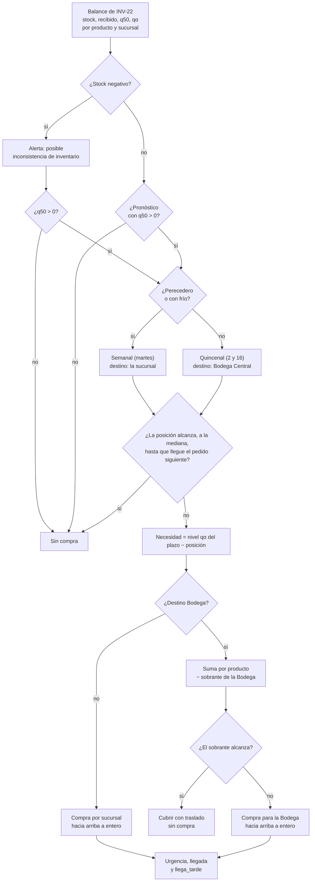

# INV-21 · Requerimientos de la recomendación de compras

Versión del 2026-09-30. Reemplaza el bosquejo del mismo día: las decisiones de
abajo se acordaron antes de implementar y los pendientes del final no bloquean.

## Resumen

INV-21 recomienda compras a proveedor para lo que las transferencias de INV-22
no alcanzan a cubrir. Parte del balance de INV-22 (stock, traslados sugeridos y
pronóstico por producto y sucursal) y compra cuando el stock no alcanza hasta
que llegue el pedido siguiente. Usa la foto de inventario al 2025-12-31 y el
pronóstico a 15 días hábiles de `/api/predict`.

**Historia de usuario.** Como gerente, quiero recomendaciones de compra a proveedor basadas en predicción de demanda y el déficit neto que no pudo cubrirse por transferencia (INV-22), para optimizar el abastecimiento sin duplicar necesidad ya resuelta internamente.

| Campo | Valor |
| --- | --- |
| Prioridad | Highest |
| Puntos | 8 |
| Épica | E7 Recomendación |
| Sprint | Sprint 5 (21 sep – 10 oct) · etiqueta momento-ii |
| Depende de | INV-20 (`POST /api/predict`) e INV-22 (`recomendar_transferencias`) |
| Alimenta a | Dashboard de recomendaciones (E9) y, más adelante, el agente NLP (E10) |

**Dentro del alcance**

- Endpoint nuevo `POST /api/compras` en `ml_service`, junto a `/api/predict` y `/api/transferencias`.
- Regla de compra por punto de pedido y nivel, sobre el balance de INV-22 y sin recalcular traslados.
- Dos calendarios de pedido: los días 2 y 16 de cada mes, y cada martes para perecederos y productos con frío.
- Destino de la compra: directo a la sucursal (perecederos y frío) o a la Bodega Central, descontando lo que la Bodega ya tiene.
- Alerta de posible inconsistencia de inventario para el stock negativo.
- Políticas en un archivo versionado propio, `politicas_inv21.json`.
- Corrección de `requiere_frio` en la categoría Congelados.

**Fuera del alcance**

- Costos de compra, negociación o comparación de precios.
- Proveedor real, lead time por proveedor y consolidación del pedido por proveedor: los proveedores de la bodega son ficticios.
- Pedidos en tránsito y flujo de aprobación de la compra (estados y pantallas en `api/`).
- La vista por sucursal para el administrador: la arma `api/` o el dashboard (E9) con los permisos por sucursal que ya existen.
- Cambios al contrato de `/api/predict` o de `/api/transferencias`.

## Punto de partida

Casi todo lo que INV-21 necesita ya está en `develop` (merge 4546718); falta la
corrección de frío en Congelados de "Cambios de datos". Las cifras son de la
bodega de pruebas, con la foto al 2025-12-31.

| Pieza | Estado actual | Uso en INV-21 |
| --- | --- | --- |
| `recomendar_transferencias(...)` (INV-22) | Balance por producto y ubicación: stock, recibido, q50, qα, déficit neto, estado. 9.737 filas de sucursal; 1.556 pares con déficit neto > 0 (1.136 productos) | Entrada de INV-21, en el mismo proceso. Descuenta todos los traslados sugeridos (P15 de INV-22) |
| `POST /api/predict` | Solo 15 días hábiles: q50 y qα (α = 0,893; 0,167 en la rama `suave_perecedero`) | Plazos distintos de 15 se derivan de la tasa diaria q/15 |
| Stock negativo | 220 filas: 205 en sucursales (116 con q50 > 0, 19 con q50 = 0, 70 sin pronóstico) y 15 en la Bodega | Alerta de posible inconsistencia |
| `es_perecedero_estricto` | 93 productos (Frutas y verduras 91, Huevos 2) | Grupo semanal y destino directo |
| `requiere_frio` | 305 productos (Lácteos, Cárnicos, Avícola, Mariscos). **Los 25 de Congelados no la tienen** | Grupo semanal y destino directo. Se corrige Congelados (ver "Cambios de datos") |
| `dim_proveedor` | 10 proveedores ficticios de INV-60 con `lead_time_dias` inventado (3 a 15) | No se usa |
| Días hábiles | Historia: días con venta. Futuro: `dim_tiempo` sin cierres programados (1 de enero, Viernes Santo). En la práctica, todos los días | Fechas de pedido, llegada y plazo a cubrir |

## Qué cambió frente al bosquejo

El bosquejo se probó con el catálogo real antes de implementar. Estos hallazgos
cambiaron la regla; la columna "Decisión" remite a la sección siguiente.

| Hallazgo | Evidencia con la foto al 2025-12-31 | Decisión |
| --- | --- | --- |
| La fórmula "demanda del lead time + stock de seguridad" es un punto de pedido, no una cantidad: da qα × 5/15 sin mirar el stock ni el déficit | En 514 de 1.556 pares compra menos que el propio déficit; en 229, más de 10 veces. Huevos (P1632) en PRINCIPAL: faltan 2.877 y compraba 1.536 | B4, B5 |
| Comprar solo sobre `deficit_neto > 0` deja pares sin cubrir hasta el pedido siguiente | 421 pares cubren los 15 días de la mediana pero se agotan antes de que llegue el pedido siguiente | B4 (cambia el criterio 1 y B6 del bosquejo) |
| "− lo ya cubierto" descuenta dos veces: `deficit_neto` ya descuenta los traslados | Arroz (P3937) en GLORIETA pasaba de 486 a 0 según cómo se leyera | B4 |
| Déficits que son solo el redondeo de los traslados | 554 pares con déficit neto < 1, como 0,19 en P3937 GLORIETA (recibió 572 de 572,19) | Dejan de importar con B4 |
| Se compraría para la Bodega lo que la Bodega ya tiene | 357 pares con sobrante suficiente en la Bodega; 350 no se trasladaron por el mínimo de 6 | B9 |
| Productos con frío irían a la Bodega, que no tiene frío (A3 de INV-22) | 254 pares con frío no perecederos | B8 |
| Alerta de stock negativo sin cantidad calculable | 89 de 205 pares: 19 con q50 = 0 y 70 sin pronóstico | B11 |
| Stock de seguridad qα − q50 negativo | 32 pares de la rama `suave_perecedero` | B5 (nivel = max(qα, q50)) |

## Decisiones acordadas

| Código | Tema | Decisión |
| --- | --- | --- |
| B1 | Lead time | 5 días hábiles para todos los productos, en políticas, hasta tener el dato real por proveedor |
| B2 | Calendario de pedidos | Los días 2 y 16 de cada mes (grupo **quincenal**). Perecederos y productos con frío, cada martes (grupo **semanal**). Si una fecha cae en un cierre programado, pasa al siguiente día hábil |
| B3 | Plazo a cubrir (P) | Días hábiles desde la foto hasta que llega el pedido siguiente al actual. En la ruta por Bodega se suma el traslado a la sucursal (regla de llegada de INV-22) |
| B4 | Cuándo comprar | Cuando la posición (stock después de los traslados de INV-22) no alcanza, a la mediana, para el plazo P |
| B5 | Cuánto comprar | Hasta el nivel del cuantil de negocio en el plazo P: nivel = max(qα, q50) × P / 15. Así la compra cubre la incertidumbre del modelo con el cuantil que el negocio eligió por costos (INV-17) |
| B6 | Redondeo | Hacia arriba, a unidad o kg entero. Sin mínimo por línea (política `minimo_linea` = 1). En kilos no se descuenta el 10 % de INV-22, que es por pérdida en el traslado |
| B7 | Grupo del producto | Perecedero (`es_perecedero_estricto`) o con frío (`requiere_frio`): semanal. El resto: quincenal |
| B8 | Destino | Perecederos y productos con frío, directo a la sucursal. El resto, a la Bodega Central |
| B9 | Compras para la Bodega | Una línea por producto con la suma de las necesidades de las sucursales, menos el sobrante que la Bodega ya tiene (`excedente_sin_destino` de INV-22; en kilos, con el 10 % de pérdida porque tendrá que trasladarse). Si el sobrante alcanza, no se compra y el producto se lista para cubrir con traslado |
| B10 | q50 = 0 y sin pronóstico | No se compra. Los pares sin pronóstico se cuentan en el resumen; su detalle sigue en `/api/transferencias` |
| B11 | Stock negativo | Toda fila con stock negativo lleva la alerta "posible inconsistencia de inventario". Si el par tiene q50 > 0, además compra con el stock tomado como 0 (sale urgente). Si no, la acción es verificar el conteo |
| B12 | Urgencia | Días hasta agotarse = posición / (q50 / 15): urgente ≤ 5, alta ≤ 10, normal. `llega_tarde` si se agota antes de que la compra llegue a la sucursal. Se recomienda igual |
| B13 | Proveedores | `dim_proveedor` es ficticio: no se usa su lead time ni la asignación, y no sale en la respuesta. Una línea por producto (pendiente 3) |

## Políticas

Los valores se leen de `ml_service/compras/politicas_inv21.json`, versionado en
el repo y validado al arrancar, como en INV-22. La respuesta dice qué versión de
las políticas de INV-21 y de INV-22 se usó.

```json
{
  "version": 1,
  "fecha": "2026-09-30",
  "horizonte_modelo_dias": 15,
  "lead_time_dias": 5,
  "calendario_pedidos": {
    "quincenal": {"dias_mes": [2, 16]},
    "semanal": {"dias_semana": ["martes"]}
  },
  "grupo_semanal": ["perecedero", "requiere_frio"],
  "destino_directo": ["perecedero", "requiere_frio"],
  "punto_pedido": "q50",
  "nivel": "max_qalfa_q50",
  "redondeo": "arriba",
  "minimo_linea": 1,
  "bodega": {"descontar_sobrante": true},
  "stock_negativo": "alerta_y_compra_si_hay_pronostico",
  "q50_cero": "sin_compra",
  "sin_pronostico": "sin_compra",
  "urgencia": {"urgente_dias": 5, "alta_dias": 10}
}
```

Igual que en INV-22, los números se ajustan sin tocar código y los textos
nombran la regla implementada: otro valor se rechaza al arrancar.

## Algoritmo



**Pasos**

1. Llamar a `recomendar_transferencias` con los mismos productos. Si responde 409 (foto sin ventas), INV-21 también.
2. Calcular el calendario de cada grupo: fecha del pedido (la primera fecha fija en o después de la foto), su llegada, la del pedido siguiente y el plazo P.
3. En cada par producto × sucursal física del balance:
   - Stock negativo: alerta. Sigue solo si q50 > 0, con posición 0.
   - Sin pronóstico o q50 = 0: sin compra.
   - Resto: punto de pedido, nivel y necesidad con las fórmulas de abajo.
4. Grupo semanal: una línea por sucursal con la necesidad redondeada hacia arriba.
5. Grupo quincenal: sumar las necesidades del producto, restar el sobrante de la Bodega y, si queda algo, una línea para la Bodega.
6. Urgencia y `llega_tarde` por sucursal. En la línea de la Bodega, las de la sucursal más urgente.
7. Ordenar las líneas por urgencia, producto y destino.

**Fórmulas** (s = sucursal; P según el grupo del producto)

```text
posición_s        = max(stock_s, 0) + recibido_s                 [de INV-22]
punto_pedido_s    = q50(15) × P / 15
nivel_s           = max(qα(15), q50(15)) × P / 15
compra si         posición_s < punto_pedido_s
necesidad_s       = nivel_s − posición_s
cantidad directa  = ⌈necesidad_s⌉
cantidad Bodega   = ⌈Σ_s necesidad_s − sobrante_bodega⌉  si es > 0
días_agotarse_s   = posición_s / (q50(15) / 15)                  [días hábiles]
```

**Calendario con la foto al 2025-12-31** (el 1 de enero es cierre)

| Grupo | Pedido | Llega | Pedido siguiente | Llega | Plazo P |
| --- | --- | --- | --- | --- | --- |
| Quincenal | 2 de enero | 7 de enero a la Bodega; 9 a la sucursal | 16 de enero | 21 a la Bodega; 23 a la sucursal | 22 días hábiles |
| Semanal | martes 6 de enero | 11 de enero, a la sucursal | martes 13 de enero | 18 de enero | 17 días hábiles |

**Ejemplos con datos reales**

| Par | Posición | q50 / qα | Punto de pedido | Nivel | Resultado |
| --- | --- | --- | --- | --- | --- |
| Huevos (P1632), PRINCIPAL, semanal | 489 | 3.366,01 / 4.608,72 | 3.814,81 | 5.223,22 | Compra **4.735** directo a PRINCIPAL. Se agota en 2,2 días: urgente y llega tarde |
| Durazno María José (00380), quincenal | PRINCIPAL 13, LA 21 1, GLORIETA 12 | — | 19,33 / 3,83 / 17,64 | 47,12 / 10,93 / 69,23 | Necesidad 101,28 − sobrante de la Bodega 49 = compra **53** para la Bodega. LA 21 se agota en 5,7 días: alta y llega tarde |
| Arroz Zulia (P3937), quincenal | GLORIETA 828, PRINCIPAL 1.251, LA 21 240 | — | — | — | Necesidad 2.494,93; la Bodega tiene 2.757: **sin compra**, se cubre con traslado |

En P3937 GLORIETA, la posición (828) cubre justo los 15 días de la mediana,
pero no los 22 hasta el pedido siguiente. La necesidad existe, pero la cubre lo
que ya está en la Bodega, así que no se compra.

## Contrato del endpoint

`POST /api/compras` vive en `ml_service` y llama a INV-22 y al pronóstico en el
mismo proceso, sin HTTP.

**Petición**

```json
{
  "productos": ["P1632", "00380", "P3937"],
  "incluir_detalle": true
}
```

| Campo | Tipo | Regla |
| --- | --- | --- |
| `productos` | lista de `codigo_item`, opcional | Sin la lista se procesa todo el catálogo de la foto. Un código desconocido va a `no_encontrados` |
| `incluir_detalle` | booleano, opcional (por defecto `true`) | Con `false` las líneas no traen el cálculo por sucursal |

**Respuesta** (valores reales con la foto al 2025-12-31; se muestran dos de
las cuatro líneas: faltan P1632 en GLORIETA y en LA 21, y el detalle está
abreviado. La implementación agregó algunos campos a `calendario` y a las
líneas; el contrato final está en `docs/ML-SERVICE-API.md`)

```json
{
  "fecha_inventario": "2025-12-31",
  "fecha_pronostico": "2025-12-31",
  "lead_time_dias": 5,
  "politicas": {"inv21": {"version": 1, "fecha": "2026-09-30"},
                "inv22": {"version": 1, "fecha": "2026-09-30"}},
  "calendario": [
    {"grupo": "quincenal", "fecha_pedido": "2026-01-02", "fecha_llegada": "2026-01-07",
     "pedido_siguiente": "2026-01-16", "cubre_hasta": "2026-01-23", "dias_cubiertos": 22},
    {"grupo": "semanal", "fecha_pedido": "2026-01-06", "fecha_llegada": "2026-01-11",
     "pedido_siguiente": "2026-01-13", "cubre_hasta": "2026-01-18", "dias_cubiertos": 17}
  ],
  "compras": [
    {"producto_id": "P1632", "destino": "PRINCIPAL", "tipo_destino": "sucursal", "grupo": "semanal",
     "cantidad": 4735, "unidad": "unidad", "urgencia": "urgente", "dias_hasta_agotarse": 2.2,
     "fecha_pedido": "2026-01-06", "fecha_llegada": "2026-01-11", "llega_tarde": true,
     "necesidad": 4734.22, "sobrante_bodega": null, "motivo": "reposicion",
     "detalle": [{"sucursal": "PRINCIPAL", "posicion": 489.0, "q50": 3366.01, "limite_superior": 4608.72,
                  "punto_pedido": 3814.81, "nivel": 5223.22, "necesidad": 4734.22,
                  "dias_hasta_agotarse": 2.2, "urgencia": "urgente", "llega_tarde": true}]},
    {"producto_id": "00380", "destino": "BODEGA_CENTRAL", "tipo_destino": "bodega_central", "grupo": "quincenal",
     "cantidad": 53, "unidad": "unidad", "urgencia": "alta", "dias_hasta_agotarse": 5.7,
     "fecha_pedido": "2026-01-02", "fecha_llegada": "2026-01-07", "llega_tarde": true,
     "necesidad": 101.28, "sobrante_bodega": 49.0, "motivo": "reposicion",
     "detalle": [{"sucursal": "LA 21", "posicion": 1.0, "q50": 2.61, "limite_superior": 7.45,
                  "punto_pedido": 3.83, "nivel": 10.93, "necesidad": 9.93,
                  "dias_hasta_agotarse": 5.7, "urgencia": "alta", "llega_tarde": true}]}
  ],
  "cubrir_con_traslado": [
    {"producto_id": "P3937", "necesidad": 2494.93, "sobrante_bodega": 2757.0, "unidad": "unidad"}
  ],
  "alertas": [],
  "no_encontrados": [],
  "resumen": {"productos": 3, "lineas": 4, "lineas_sucursal": 3, "lineas_bodega": 1,
              "cantidad": {"unidad": 10086, "kg": 0}, "cubiertos_por_bodega": 1,
              "alertas": 0, "pares_sin_pronostico": 0}
}
```

| Campo | Valores |
| --- | --- |
| `compras[].grupo` | `quincenal` (2 y 16) o `semanal` (martes) |
| `compras[].tipo_destino` | `sucursal` o `bodega_central` |
| `compras[].motivo` | `reposicion` o `stock_negativo` (el par se compró con stock tomado como 0) |
| `compras[].fecha_llegada` | Llegada al destino de la línea. En la Bodega, la sucursal la recibe con el traslado siguiente |
| `urgencia` | `urgente` (≤ 5 días hábiles), `alta` (≤ 10), `normal` |
| `unidad` | `unidad` o `kg`, según `se_vende_por_kilo` |
| `alertas[].accion` | `compra_urgente` (q50 > 0) o `verificar_conteo` |
| `resumen.cantidad` | Separada por unidad, para no sumar unidades con kilos |

Una alerta, con `"productos": ["P4650"]` (stock −70 en LA 21 y q50 15,68):

```json
{"producto_id": "P4650", "sucursal": "LA 21", "tipo": "posible_inconsistencia_inventario",
 "stock": -70.0, "accion": "compra_urgente",
 "detalle": "Stock negativo en la foto: verificar el conteo. Se compra con el stock tomado como 0."}
```

**Errores**

| Código | Cuándo |
| --- | --- |
| 409 | La foto de inventario es posterior a la última venta cargada (la misma regla de INV-22) |
| 422 | El cuerpo no cumple el esquema |
| 503 | Bodega no disponible o calendario insuficiente para el plazo |

**Función pública.** `recomendar_compras(bodega, modelos, politicas_inv21,
politicas_inv22, productos=None)` en `ml_service/compras/motor.py`, para que el
dashboard o el agente la llamen en el mismo proceso si lo necesitan.

## Cambios de datos

**Frío en Congelados.** `requiere_frio` parte de `es_refrigerado`, que se asigna
por las categorías del modelo (Lácteos, Avícola, Mariscos, Cárnicos) y no
incluye Congelados. Por eso helados, trucha, mojarra y papa congelada no tienen
la marca.

| Cambio | Detalle |
| --- | --- |
| Regla | `requiere_frio` también es verdadero en la categoría Congelados, salvo palabra de producto estable u override. `es_refrigerado` no cambia: es feature del modelo y la paridad de INV-20 se mantiene |
| Override | `P431` (palos para paletas) queda sin frío en `etl_real/overrides_requiere_frio.csv` |
| Resultado esperado | 329 productos con frío (305 + 24) |
| Efecto en INV-22 | Los congelados ya no pueden entrar a la Bodega. La papa precocida (02276, 2 unidades) queda como producto con frío en la Bodega: puede salir, no entrar (A3). La verificación de `database/test-dw-real.SQL` pasa a esperar 1 producto con frío en la Bodega |
| Archivos | `etl_real/config.py`, `etl_real/atributos_producto.py`, el CSV de overrides, `etl_real/tests/`, `database/test-dw-real.SQL` y una recarga de `dim_producto` (`construir_dim_producto.py` y `cargar_postgres.py`) |

## Criterios de aceptación

Reemplazan los ocho del bosquejo.

1. INV-21 parte del balance de `recomendar_transferencias`, en el mismo proceso: no recalcula traslados y descuenta todos los sugeridos (P15 de INV-22).
2. El grupo del producto sale de sus marcas: perecedero o con frío, semanal (martes) y directo a la sucursal; el resto, quincenal (2 y 16) y a la Bodega Central (B2, B7, B8).
3. La fecha de pedido es la primera fecha fija del grupo en o después de la foto; si cae en un cierre programado, pasa al siguiente día hábil (B2).
4. El plazo P va de la foto a la llegada del pedido siguiente, en días hábiles, más el traslado en la ruta por Bodega (B3).
5. Se compra si la posición es menor que q50 × P / 15. La cantidad es nivel − posición, con nivel = max(qα, q50) × P / 15, redondeada hacia arriba (B4–B6).
6. En la ruta por Bodega hay una línea por producto: la suma de las sucursales menos el sobrante de la Bodega. Si el sobrante alcanza, no se compra y el producto va a `cubrir_con_traslado` (B9).
7. Los pares con q50 = 0 o sin pronóstico no compran (B10).
8. Todo stock negativo lleva la alerta `posible_inconsistencia_inventario`. Con q50 > 0 compra con stock 0 (`compra_urgente`); si no, `verificar_conteo` (B11).
9. La urgencia sale de los días hasta agotarse (≤ 5 urgente, ≤ 10 alta) y `llega_tarde` marca las compras que llegan después del agotamiento (B12).
10. Lead time, calendario y reglas se leen de `politicas_inv21.json`. La respuesta dice qué versión de INV-21 y de INV-22 usó.
11. `requiere_frio` queda corregido en Congelados sin tocar `es_refrigerado`.
12. `POST /api/predict` y `POST /api/transferencias` no cambian de contrato y sus pruebas siguen pasando.

## Casos de prueba y Definition of Done

Las pruebas unitarias usan `BodegaFalsa` y `PronosticosFijos` de
`ml_service/tests/conftest.py`, con inventario y pronósticos fijos. Los modelos
reales solo se usan en las pruebas de integración. La cobertura mínima es 80 %.

| Caso | Datos | Resultado esperado |
| --- | --- | --- |
| Alcanza hasta el pedido siguiente | Posición ≥ q50 × P / 15 | Sin compra |
| Cubre 15 días pero no el plazo | Posición = q50(15) y P = 22 | Compra hasta el nivel |
| Déficit después de traslados | Posición bajo q50 con traslado recibido | La posición incluye lo recibido; compra nivel − posición |
| Perecedero | Déficit en una sucursal | Grupo semanal, destino la sucursal, nunca la Bodega |
| Con frío no perecedero | Déficit en una sucursal | Igual que el perecedero |
| Seco en dos sucursales | Necesidad en ambas | Una sola línea para la Bodega con la suma |
| Sobrante suficiente en la Bodega | Sobrante ≥ suma de necesidades | Sin compra; el producto aparece en `cubrir_con_traslado` |
| Sobrante parcial | Sobrante menor que la suma | Compra por la diferencia |
| q50 = 0 | Vigilancia en INV-22 | Sin compra |
| Sin pronóstico | Par sin historia | Sin compra; cuenta en `pares_sin_pronostico` |
| Stock negativo con q50 > 0 | Stock −4 | Alerta `compra_urgente` y compra con posición 0 |
| Stock negativo sin pronóstico | Stock −4 sin q50 | Solo alerta `verificar_conteo` |
| Perecedero con qα < q50 | Rama `suave_perecedero` | Nivel = q50 × P / 15 |
| Kilos | Necesidad de 7,2 kg | Compra 8 kg, sin descuento |
| Kilos en la Bodega | Sobrante de 10 kg | Descuenta 9 kg (10 % de pérdida) |
| Fecha en cierre | Fecha fija que cae el 1 de enero | El pedido pasa al siguiente día hábil |
| Foto en día de pedido | Foto un martes (semanal) | El pedido sale ese mismo día |
| Llega tarde | Agotamiento en 2 días y llegada en 6 | Compra con `llega_tarde = true` |
| Políticas | Cambiar `lead_time_dias` en el JSON | Cambian P, la llegada y la cantidad sin tocar código |
| Foto sin ventas | Foto posterior a la última venta | 409 |

**Integración con la bodega real** (marca `bodega`, se salta si no hay Postgres)

- Los ejemplos de arriba: P1632 PRINCIPAL compra 4.735; 00380 compra 53 para la Bodega; P3937 queda en `cubrir_con_traslado`.
- q50, qα y posición de una muestra de pares coinciden con el balance de `/api/transferencias`.
- El catálogo completo corre sin una consulta por par; se mide y documenta su tiempo.

**Definition of Done**

- [ ] Cumple los 12 criterios de aceptación.
- [ ] Pruebas unitarias con cobertura ≥ 80 %, incluidos los casos de la tabla.
- [ ] Autorrevisión documentada en el commit o PR.
- [ ] `docs/INV-21-compras.md` con la implementación y el archivo de políticas explicado; `docs/ML-SERVICE-API.md` con el endpoint nuevo.
- [ ] Integrado en `develop`.
- [ ] Verificado con Docker Compose local (`postgres` + `ml-service`).
- [ ] Sin bugs bloqueantes.
- [ ] `/api/predict` y `/api/transferencias` verificados sin regresión.

## Resultados esperados con los datos reales

Simulación previa con el balance real de INV-22 y las reglas de este documento
(Congelados ya con frío). La implementación debe confirmarla.

| Métrica | Valor |
| --- | --- |
| Pares que compran | 2.051 (incluye los 1.556 con déficit neto en INV-22) |
| Líneas de compra | 1.340: 449 directas a sucursal y 891 para la Bodega |
| Cantidad | 41.952 unidades y 3.169 kg |
| Productos cubiertos por el sobrante de la Bodega | 277 |
| Urgencia | 585 urgentes, 255 altas, 500 normales; 784 llegan tarde |
| Alertas de inconsistencia | 205 en sucursales (116 compran) y 15 en la Bodega |
| Productos del grupo semanal | 422 (93 perecederos, 305 con frío y 24 congelados) |

## Pendientes de confirmar

Ninguno bloquea el desarrollo: cada uno tiene un valor por defecto en el archivo
de políticas o en un override.

| # | Pregunta al negocio | Valor por defecto mientras tanto | Dónde se ajusta |
| --- | --- | --- | --- |
| 1 | ¿Lead time real por proveedor o por categoría? | 5 días hábiles para todos | `lead_time_dias` |
| 2 | ¿Stock de seguridad adicional en categorías críticas? | No: el nivel en qα ya cubre la incertidumbre del modelo | `nivel` |
| 3 | ¿Consolidar el pedido por proveedor? | Producto por producto; requiere proveedores reales | Historia posterior |
| 4 | ¿Mínimos de compra o empaques por proveedor? | Sin mínimo | `minimo_linea` |
| 5 | Revisión de los 24 congelados que pasan a tener frío | Regla por categoría, con P431 fuera | `overrides_requiere_frio.csv` |

## Ambiente de desarrollo

1. Crear la rama desde `develop` actualizado: `git checkout -b feature/INV-21-compras`.
2. Aplicar el cambio de datos de Congelados y recargar `dim_producto`; `database/test-dw-real.SQL` sin ningún `NO CUMPLE`.
3. Pruebas desde `ml_service/`: `pytest` y `pytest -m bodega`.
4. Levantar con `docker compose up -d --build ml-service` y probar:

   ```
   Invoke-RestMethod http://localhost:8001/api/compras -Method Post -ContentType "application/json" -Body '{"productos": ["P1632", "00380", "P3937"]}'
   ```
5. Comprobar que `/api/predict` y `/api/transferencias` responden igual que antes, salvo el efecto esperado de Congelados en los traslados.

**Archivos a crear o tocar en `ml_service`**

| Archivo | Cambio |
| --- | --- |
| `compras/politicas.py` y `politicas_inv21.json` (nuevos) | Carga y validación de políticas al arrancar |
| `compras/calendario.py` (nuevo) | Fechas de pedido, llegada y plazo P por grupo |
| `compras/motor.py` (nuevo) | `recomendar_compras`, sin I/O propio más allá de INV-22 |
| `compras/router.py` y `schemas/compras.py` (nuevos) | Endpoint y esquemas Pydantic |
| `core/config.py` y `main.py` | Ruta de las políticas y registro del router |
| `tests/test_compras_*.py` (nuevos) | Casos de la tabla e integración |

## Riesgos y limitaciones

- **Foto única.** Hasta que lleguen datos de 2026, la historia valida la regla, no la operación diaria.
- **Sin pedidos en tránsito.** Si se corre dos veces antes de que llegue la compra, la recomienda dos veces. Debe correrse en las fechas de pedido; guardar pedidos queda para la historia de aprobación.
- **Plazos distintos de 15 días.** El modelo solo pronostica 15 días; 17 y 22 se derivan escalando q50 y qα por la tasa diaria. Escalar qα de forma lineal sobreestima algo la incertidumbre, así que la compra queda un poco por arriba, en línea con Q8 de INV-22.
- **Intermitentes.** En el 98,6 % de pares intermitentes el qα queda muy por encima de la mediana, así que las compras son grandes frente a q50. Sale de los costos del negocio (α = 0,893); si resulta excesivo, se ajusta en INV-17, no aquí.
- **Muchas compras llegan tarde** (784 de 1.340 con la foto actual): son pares que ya están casi sin stock. Se marcan, no se bloquean.
- **Traslados no ejecutados.** Como se descuentan todos los traslados sugeridos, uno que no se haga deja la compra corta.
- **Cubrir con traslado.** Los productos de `cubrir_con_traslado` dependen de que INV-22 los traslade en su momento; hoy no lo hace porque la sucursal todavía está sobre su mediana de 15 días.
- **Costos.** No se usan; la anomalía de costo de 02924 (INV-22) no afecta esta historia.
