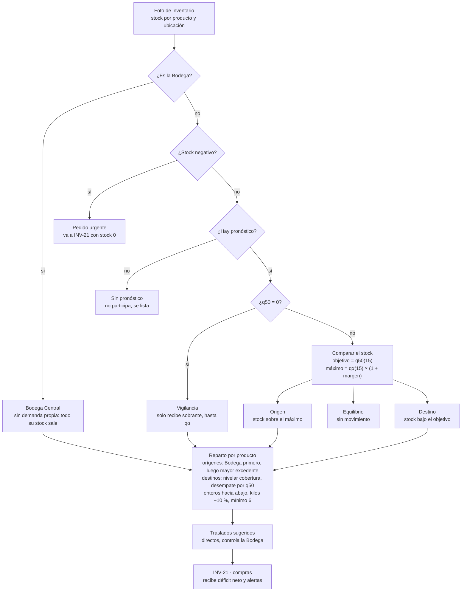

# INV-22 · Requerimientos de transferencias entre sucursales

Versión del 2026-09-30.

## Resumen

INV-22 recomienda traslados de stock entre sucursales y desde la Bodega Central antes de comprar a proveedor. Usa la foto de inventario al 2025-12-31 y el pronóstico de demanda a 15 días hábiles.

**Historia de usuario.** Como gerente, quiero recomendaciones de transferencias de stock entre sucursales y Bodega Central, para redistribuir excedentes antes de generar una necesidad de compra a proveedor.

| Campo | Valor |
| --- | --- |
| Prioridad | Highest |
| Puntos | 5 |
| Épica | E7 Recomendación |
| Sprint | Sprint 5 (21 sep – 10 oct) · etiqueta momento-ii |
| Depende de | INV-20 (`POST /api/predict`) e INV-61 (`dw.fact_inventario`) |
| Alimenta a | INV-21 (recomendación de compras): recibe el déficit neto y las alertas |

**Dentro del alcance**

- Endpoint nuevo `POST /api/transferencias` en `ml_service`.
- Las 15 políticas de negocio (P1–P15) en un archivo de configuración versionado.
- Dos marcas de logística nuevas en `dw.dim_producto`: `requiere_frio` y `se_vende_por_kilo`.
- Déficit neto por producto y sucursal, y alertas, listos para INV-21.

**Fuera del alcance**

- Stock vivo. Solo existe la foto al 2025-12-31; el resultado valida el algoritmo mientras llegan datos de 2026.
- Horizonte de 30 días. Queda para una fase futura, porque exige reentrenar los modelos.
- Costos de flete, rutas y el flujo de aprobación de traslados (estados y pantallas en `api/`).
- Cambios al contrato de `/api/predict` o a las variables del modelo.

## Punto de partida

Casi todo lo que INV-22 necesita ya está en `develop` (merge 47e8e3a): la bodega en Postgres y el servicio de pronóstico. Faltan las dos marcas de producto de la sección de cambios de datos. Las cifras son de la bodega de pruebas, con la foto al 2025-12-31.

| Pieza | Estado actual | Uso en INV-22 |
| --- | --- | --- |
| `dw.dim_sucursal` | 5 filas: PRINCIPAL (principal), LA 21 y GLORIETA (estandar), SIN_SUCURSAL (sin_terminal) y BODEGA_CENTRAL (bodega_central) | Las 3 sucursales físicas y la Bodega. SIN_SUCURSAL se excluye |
| `dw.fact_inventario` | Una sola foto al 2025-12-31: PRINCIPAL 4.046, GLORIETA 3.194, LA 21 1.888 y Bodega 1.973 filas | Solo `stock_disponible` es real. `stock_minimo`, `stock_maximo`, `punto_reorden` y `dias_cobertura` salen de la fórmula de la simulación y no se usan |
| Stock negativo | 220 filas: PRINCIPAL 95, GLORIETA 70, LA 21 40, Bodega 15 | Alertas de pedido urgente |
| Productos repartidos | 3.047 con stock positivo en 2 o más ubicaciones | Candidatos a traslado |
| `POST /api/predict` | 15 días hábiles. Devuelve la mediana q50 y el límite superior qα (α = 0,893 en la rama intermitente) | Objetivo y máximo de cada par producto × sucursal |
| Cobertura del modelo | 6.427 pares con pronóstico en la matriz de entrenamiento; 98,6 % son intermitentes | Cerca de 2.700 filas de inventario en sucursales quedan sin pronóstico (estimado) |
| `es_perecedero_estricto` | 93 productos (Frutas y verduras, Huevos) | Regla de perecederos |
| `es_refrigerado` | 429 productos, asignado por categoría (Lácteos, Avícola, Mariscos, Cárnicos); 35 tienen stock en la Bodega (884 unidades) | No sirve como marca de frío: incluye atún y sardinas enlatados, leche en polvo y caldos |
| Cantidades con decimales | 176 filas de inventario y 143.034 líneas de venta (7 %), sobre todo Frutas y verduras (75 productos) | Productos que se venden por kilo |

La última venta cargada también es del 2025-12-31, así que el stock y el pronóstico quedan a la misma fecha. Ejemplos de refrigerados en la Bodega: RICOSTILLA \*UND (120 unidades) y ATUN SOBERANA LOMITOS ACEITE SOYA \*150GR (117).

## Decisiones acordadas

El negocio fijó estas reglas el 2026-09-30 y no se renegocian en la implementación. Los códigos A son acuerdos; los Q son respuestas a los quiebres detectados.

| Código | Tema | Decisión |
| --- | --- | --- |
| A1 | Horizonte | 15 días hábiles. El de 30 días queda para una fase futura con más datos. |
| A2 | Control de traslados | Directos entre sucursales. La Bodega Central los controla y registra; la mercancía no pasa por ella. |
| A3 | Cadena de frío | La Bodega no tiene frío. Los productos con frío pueden salir de ella, nunca entrar. |
| A4 | Stock negativo | Anomalía o mal registro. No se traslada y es candidato a pedido urgente. |
| A5 | Perecederos | Se usa `es_perecedero_estricto`, la misma marca de las ramas del modelo. No entran a la Bodega. |
| A6 | Fuente de stock | La foto de `fact_inventario`, sin stock vivo. El pronóstico se calcula a la fecha de la foto. |
| Q1 | Otras fechas | No existen. El cálculo al 2025-12-31 sirve para validar el algoritmo mientras llegan datos de 2026. |
| Q2 | Frío en la Bodega | Algunos de los 35 productos pueden estar mal clasificados. Regla: salen de la Bodega, no entran. |
| Q3 | Stock negativo | Son anomalías o malos registros; candidatos a solicitud de pedido. |
| Q4 | Pares sin pronóstico | No hay forma de estimar su venta. Se asume que se venderá en un horizonte largo, así que su stock no es excedente. |
| Q5 | Mediana en cero | Igual que Q4: el stock de un par con q50 = 0 no es excedente. |
| Q6 | Excedente insuficiente | Orden de repartición fijo; lo que no se cubre va como solicitud de pedido a INV-21. |
| Q7 | Traslado tardío | Es un tema logístico: los traslados salen en días fijos de la semana. |
| Q8 | Traslado no ejecutado | Compras estima por arriba según el arribo del producto. El arribo no se controla, pero 15 días es el máximo por proveedor. |
| Q9 | Cantidades con decimales | Son kilos. Se descuenta 10 % por posibles pérdidas y se redondea hacia abajo. |

Por analogía con Q2, el único perecedero con stock en la Bodega (3 unidades) también puede salir de ella.

## Políticas P1–P15

Los valores se leen de `ml_service/transferencias/politicas_inv22.json`, versionado en el repo. Cambiar una política no debe requerir cambiar código, y la respuesta indica qué versión se usó.

| Código | Política | Valor definido | Parámetros |
| --- | --- | --- | --- |
| P1 | Stock máximo en sucursal | Límite superior con margen: máximo = qα(15) × (1 + margen) | Margen 25 % en perecederos y 50 % en no perecederos (pendiente 1). El origen conserva al menos 2 unidades |
| P2 | Objetivo del destino | Mediana q50(15) | Margen generoso en no perecederos para no mover inventario que se vende pronto (se aplica en P1) |
| P3 | Reserva de la Bodega | Sin reserva: todo su stock positivo está disponible | — |
| P4 | Perecederos | Directo entre sucursales | Solo hacia sucursales con q50 > 0 |
| P5 | Cadena de frío | Marca nueva `requiere_frio`, revisada por el negocio | Traslados directos entre sucursales |
| P6 | Pares sin pronóstico | No participan; se listan aparte | — |
| P7 | Stock negativo en el pedido | Se toma como 0, con aviso de verificar el conteo | — |
| P8 | Foto más nueva que las ventas | No se recomienda; se avisa que faltan ventas | — |
| P9 | Repartición entre destinos | Nivelar cobertura | Desempate por mayor q50 |
| P10 | Orden de los orígenes | Bodega Central primero, luego la sucursal con más excedente | — |
| P11 | Cantidades | Enteros hacia abajo; kilos con 10 % menos y hacia abajo | Mínimo 6 por traslado (en kilos, pendiente 4) |
| P12 | Excedente sin destino | Se queda donde está y se reporta | — |
| P13 | Urgencia | Si el traslado llega tarde, se hace igual y se marca | Urgente ≤ 5 y alta ≤ 10 días hábiles. Traslado de 2 días hábiles hasta definir los días fijos (pendiente 3) |
| P14 | Pares con q50 = 0 | Reciben solo lo que sobre, hasta qα. Nunca son urgentes | — |
| P15 | Efecto en compras | INV-21 descuenta todos los traslados sugeridos | La aprobación queda para una historia posterior |

Forma propuesta del archivo:

```json
{
  "version": 1,
  "fecha": "2026-09-30",
  "horizonte_dias": 15,
  "stock_maximo": {"margen_perecedero": 0.25, "margen_no_perecedero": 0.50, "unidades_exhibicion": 2},
  "objetivo_destino": "q50",
  "reserva_bodega": 0,
  "perecederos": {"traslado": "directo", "solo_con_venta": true},
  "frio": {"traslado": "directo", "entra_a_bodega": false},
  "sin_pronostico": "excluir",
  "stock_negativo": "como_cero",
  "foto_sin_ventas": "bloquear",
  "reparticion": {"metodo": "nivelar_cobertura", "desempate": "q50"},
  "origenes": "bodega_primero",
  "cantidades": {"minimo": 6, "descuento_kilos": 0.10},
  "excedente_sin_destino": "se_queda",
  "urgencia": {"urgente_dias": 5, "alta_dias": 10, "llega_tarde": "trasladar_y_marcar"},
  "traslado": {"dias_semana": [], "dias_habiles_si_no_hay_dias_fijos": 2},
  "q50_cero": "solo_sobrante",
  "compras_descuenta": "sugeridos"
}
```

## Algoritmo

El cálculo va producto por producto: clasifica cada ubicación, cruza excedentes con déficits y entrega el déficit neto a compras.



Las cuatro preguntas apartan lo que no participa. Solo el stock sobre el máximo alimenta el reparto, y lo que falta después del reparto va a INV-21.

**Pasos por producto**

1. Validar fechas. La foto debe ser del mismo día que la última venta cargada; si es posterior, responder 409 (P8). El pronóstico se calcula a la fecha de la foto.
2. Clasificar el producto: perecedero, `requiere_frio` y `se_vende_por_kilo`.
3. Bodega Central: todo su stock positivo es excedente (P3). Si su stock es negativo, alerta y fuera.
4. En cada sucursal física:
   - Stock negativo: alerta `pedido_urgente` y fuera (P7).
   - Sin fila en la foto: stock 0.
   - Sin pronóstico: alerta `sin_pronostico` y fuera; su stock no es excedente (P6, Q4).
   - q50 = 0: vigilancia. No es origen y su déficit de vigilancia es qα − stock (P14, Q5).
   - Resto: objetivo, máximo, excedente y déficit con las fórmulas de abajo.
5. Sin excedente o sin déficit no hay traslados. El excedente se queda (P12) y el déficit pasa completo al neto.
6. Juntar el excedente de los orígenes permitidos. En kilos, cada excedente se multiplica por 0,9 antes (Q9).
7. Repartir entre destinos con q50 > 0. Si alcanza, cada uno recibe su déficit. Si no, cada unidad (o kilo) va al destino con menor cobertura, con desempate por mayor q50 (P9).
8. Asignar orígenes: primero la Bodega, luego la sucursal con más excedente restante (P10). Cada par origen → destino es un traslado.
9. Redondear hacia abajo y descartar traslados menores a 6 (P11). Lo descartado se queda en el origen y el déficit sigue en el neto.
10. Llevar el sobrante a los pares en vigilancia que no sean perecederos, de mayor a menor límite superior, con las mismas reglas.
11. Calcular urgencia y llegada: días hasta agotarse y fecha de llegada según los días fijos. Marcar `llega_tarde` si el agotamiento ocurre antes (P13).
12. Armar el balance por par y las alertas: es la respuesta y la entrada de INV-21.

**Rutas permitidas.** Sucursal → sucursal siempre. Bodega → sucursal para cualquier producto que ya esté en la Bodega, incluidos los de frío y los perecederos. En esta versión nada entra a la Bodega, porque el excedente sin destino se queda donde está (P12).

**Fórmulas** (s = sucursal)

```text
objetivo_s      = q50(15)
máximo_s        = max( qα(15) × (1 + m), objetivo_s )
excedente_s     = max( 0, stock_s − max(máximo_s, 2) )
déficit_s       = max( 0, objetivo_s − stock_s )
cobertura_s     = (stock_s + recibido_s) / (q50(15) / 15)      [días hábiles]
déficit_neto_s  = max( 0, déficit_s − recibido_s )
```

m vale 0,25 en perecederos y 0,50 en no perecederos. Los días hasta agotarse son la cobertura con recibido = 0, en días hábiles.

## Contrato del endpoint

`POST /api/transferencias` vive en `ml_service`, junto a `/api/predict`. Usa el mismo motor de pronóstico dentro del mismo proceso, sin llamarse por HTTP a sí mismo. Es una ruta propia porque recibe un producto o el catálogo y devuelve movimientos; `/api/predict` sigue respondiendo un solo par, sin cambios.

**Petición**

```json
{
  "productos": ["P0001", "P0002"],
  "incluir_balance": true
}
```

| Campo | Tipo | Regla |
| --- | --- | --- |
| `productos` | lista de `codigo_item`, opcional | Sin la lista se procesan todos los productos con fila en la foto. Un código desconocido va a `no_encontrados`, no produce error |
| `incluir_balance` | booleano, opcional (por defecto `true`) | Con `false` solo se devuelven traslados, alertas y resumen |

No hay parámetro de fecha: se usa la foto más reciente de `fact_inventario` (hoy, 2025-12-31).

**Respuesta** (valores ilustrativos)

```json
{
  "fecha_inventario": "2025-12-31",
  "fecha_pronostico": "2025-12-31",
  "horizonte_dias": 15,
  "politicas": {"version": 1, "fecha": "2026-09-30"},
  "traslados": [
    {"producto_id": "P0001", "origen": "BODEGA_CENTRAL", "destino": "LA 21",
     "cantidad": 12, "unidad": "unidad", "urgencia": "urgente",
     "dias_hasta_agotarse": 2.2, "fecha_llegada": "2026-01-05", "llega_tarde": false}
  ],
  "balance": [
    {"producto_id": "P0001", "sucursal": "LA 21", "rama": "intermitente",
     "stock": 3, "q50": 20.1, "limite_superior": 31.0,
     "objetivo": 20.1, "maximo": 46.5, "excedente": 0, "deficit": 17.1,
     "recibido": 12, "deficit_neto": 5.1, "estado": "destino", "urgencia": "urgente"}
  ],
  "alertas": [
    {"producto_id": "P0002", "sucursal": "PRINCIPAL", "tipo": "stock_negativo",
     "stock": -4, "accion": "pedido_urgente"}
  ],
  "no_encontrados": [],
  "resumen": {"productos": 2, "traslados": 1, "cantidad_trasladada": 12,
              "deficit_total": 17.1, "deficit_neto": 5.1, "alertas": 1}
}
```

| Campo | Valores |
| --- | --- |
| `estado` | `origen`, `destino`, `vigilancia` (q50 = 0), `equilibrio`, `sin_pronostico`, `stock_negativo`, `bodega` |
| `urgencia` | `urgente` (≤ 5 días hábiles), `alta` (≤ 10), `normal`, `vigilancia` |
| `unidad` | `unidad` o `kg`, según `se_vende_por_kilo` |
| `alertas[].tipo` | `stock_negativo` (acción `pedido_urgente`) o `sin_pronostico` (acción `ninguna`) |

**Errores**

| Código | Cuándo |
| --- | --- |
| 409 | La foto de inventario es más nueva que la última venta cargada (P8). El detalle dice cuántos días faltan |
| 422 | El cuerpo no cumple el esquema |
| 503 | Bodega no disponible o calendario insuficiente, igual que en `/api/predict` |

**Salida para INV-21.** La lógica vive en una función pública, `recomendar_transferencias(bodega, modelos, politicas, productos=None)`, en `ml_service/transferencias/motor.py`. INV-21 la llama en el mismo proceso y toma `balance[].deficit_neto` y `alertas`; no recalcula traslados. Como INV-21 descuenta todos los traslados sugeridos (P15), no hace falta guardar el resultado en una tabla en esta historia.

## Cambios de datos

Hacen falta dos marcas de logística en `dw.dim_producto` y dos consultas nuevas en la bodega. Ninguna toca las columnas que usa el modelo (`requiere_espacio_bodega`, `es_perecedero_estricto`, `es_refrigerado`, `es_papel_higienico_grande`, `es_temporada`). Así se mantiene la paridad de features de INV-20.

| Columna nueva | Regla inicial | Cómo la corrige el negocio |
| --- | --- | --- |
| `requiere_frio` | `es_refrigerado` y el nombre no indica un producto estable. Las palabras viven en `etl_real/config.py`, empezando por ATUN, SARDINA, EN POLVO, CALDO y RICOSTILLA | `etl_real/overrides_requiere_frio.csv` (`codigo_item`, `requiere_frio`, `motivo`), mantenido por el negocio. Manda sobre la regla |
| `se_vende_por_kilo` | La mitad o más de sus líneas de venta tienen decimales (propuesta, pendiente 4) | `etl_real/overrides_por_kilo.csv`, con la misma forma |

**Archivos del ETL**

- `etl_real/atributos_producto.py` y `etl_real/config.py`: reglas y listas de palabras.
- `etl_real/construir_dim_producto.py`: agrega las dos columnas.
- `database/init.sql`: columnas en la tabla y, en la sección de migraciones, `ALTER TABLE dw.dim_producto ADD COLUMN IF NOT EXISTS … BOOLEAN NOT NULL DEFAULT FALSE`.
- `etl_real/cargar_postgres.py`: incluir las columnas si la lista de columnas es explícita.
- `database/test-dw-real.SQL`: conteos de ambas marcas y cuántos productos con frío tienen stock en la Bodega (hoy 35 con la marca por categoría).
- `etl_real/tests/`: pruebas de ambas reglas y de los overrides.

**Entregable para el negocio.** Antes de cerrar la historia se exporta la lista de productos con `requiere_frio` y `se_vende_por_kilo` para revisión. Los cambios que pida el negocio van a los CSV de overrides, no al código.

**Consultas nuevas en `ml_service/prediccion/bodega.py`**

| Método | Devuelve |
| --- | --- |
| `fecha_inventario()` | La fecha de la foto más reciente en `fact_inventario` |
| `inventario(fecha, codigos=None)` | `stock_disponible` por producto y ubicación, con las marcas del producto y el tipo de ubicación |
| `ventas_diarias_lote(codigos, sucursales, hasta)` | Las series de venta de muchos pares en una sola consulta, para no consultar par por par en el catálogo completo |

**Días fijos de traslado.** Van en el archivo de políticas (`traslado.dias_semana`, p. ej. `["martes", "viernes"]`). La fecha de llegada es el siguiente día fijo hábil después de la fecha de la foto. Mientras la lista esté vacía, se usan 2 días hábiles.

## Criterios de aceptación

Reemplazan los seis criterios originales de la historia; los cambios vienen de las decisiones y políticas de arriba.

1. Para cada producto y sucursal física con pronóstico, calcula objetivo = q50(15) y máximo = qα(15) × (1 + margen). Hay excedente si el stock supera el máximo y déficit si queda bajo el objetivo (P1, P2).
2. La Bodega Central no tiene demanda propia y todo su stock positivo es excedente (P3). Es el origen preferido (P10). Puede despachar productos con frío o perecederos que ya tenga, pero nunca los recibe (A3, A5).
3. Los perecederos (`es_perecedero_estricto`) se trasladan solo directo entre sucursales y solo hacia sucursales con q50 > 0 (P4).
4. Los productos con `requiere_frio` se trasladan directo entre sucursales y nunca entran a la Bodega (P5).
5. Cuando el excedente no alcanza, se reparte nivelando la cobertura de los destinos, con desempate por mayor q50 (P9). Cada traslado es el mínimo entre el excedente asignado y el déficit.
6. Las cantidades se redondean hacia abajo; en kilos se descuenta 10 % antes. No se sugieren traslados menores a 6 (P11).
7. La urgencia sale de los días hasta agotarse sobre q50: urgente ≤ 5 y alta ≤ 10 días hábiles. Un traslado que llega después del agotamiento se sugiere igual y se marca `llega_tarde` (P13).
8. Los pares con q50 = 0 no son origen, nunca son urgentes y reciben solo lo que sobre, hasta qα (Q5, P14).
9. El stock negativo no se traslada: genera la alerta `pedido_urgente` con stock tomado como 0 (A4, P7). Los pares sin pronóstico no participan y se listan (P6).
10. La respuesta expone, por producto y sucursal, el déficit, lo recibido y el déficit neto. También las alertas, para que INV-21 las consuma sin recalcular (P15).
11. Si la foto de inventario es más nueva que la última venta cargada, responde 409 y no recomienda (P8).
12. Las políticas se leen de un archivo versionado y la respuesta dice qué versión usó.
13. `POST /api/predict` no cambia: las 53 pruebas actuales de `ml_service` siguen pasando.

## Casos de prueba y Definition of Done

Las pruebas unitarias usan una bodega en memoria, como `BodegaFalsa` en `ml_service/tests/conftest.py`, con inventario y pronósticos fijos. Los modelos reales solo se usan en las pruebas de integración. La cobertura mínima es 80 %.

| Caso | Datos | Resultado esperado |
| --- | --- | --- |
| Excedente sin déficit | Un origen sobre el máximo; ningún destino bajo el objetivo | Sin traslados; el excedente queda reportado en el origen (P12) |
| Déficit sin excedente | Un destino bajo el objetivo; nadie sobre el máximo | Sin traslados; déficit neto = déficit |
| Empate exacto | Excedente igual al déficit | Un traslado por el total; déficit neto 0 |
| Desempate | Dos destinos con la misma cobertura y excedente para uno | Recibe primero el de mayor q50 |
| Nivelación | Dos destinos y excedente insuficiente | Las coberturas finales quedan parejas, con diferencia menor a una unidad de venta diaria |
| Bodega primero | Excedente en la Bodega y en una sucursal | Sale primero de la Bodega (P10) |
| Perecedero | Déficit en una sucursal con q50 > 0 y en otra con q50 = 0 | Solo recibe la de q50 > 0; nunca hay traslado hacia la Bodega |
| Frío en la Bodega | Producto con `requiere_frio` con stock en la Bodega | Puede salir de la Bodega; nunca aparece como destino Bodega |
| Intermitente con q50 = 0 | q50 = 0 y límite superior mayor que el stock | Estado `vigilancia`, no urgente. Recibe solo el sobrante tras atender a los de q50 > 0 |
| Stock negativo | Stock −4 en una sucursal | Sin traslados; alerta `pedido_urgente` con stock tomado como 0 |
| Sin pronóstico | Par sin historia suficiente | Excluido; alerta `sin_pronostico`; su stock no es excedente |
| Mínimo de 6 | Asignación de 5 unidades | Traslado descartado; el déficit sigue en el neto |
| Kilos | Excedente de 10,0 kg | Asignación máxima de 9 kg |
| Exhibición | Origen con 3 unidades y máximo 0,5 | Excedente de 1 unidad, porque conserva 2 |
| Llega tarde | Agotamiento en 1 día hábil y traslado de 2 | Traslado sugerido con `llega_tarde = true` |
| Foto sin ventas | Fecha de la foto posterior a la última venta | 409 |
| Políticas | Cambiar el margen en el JSON | Cambia el máximo sin tocar código |

**Integración con la bodega real** (marca `bodega`, se salta si no hay Postgres)

- Para una muestra de pares, q50 y límite superior del balance coinciden con `/api/predict` para el mismo par.
- El stock del balance coincide con `fact_inventario` al 2025-12-31.
- Al menos un escenario real verificado a mano: un producto con stock en la Bodega y déficit en una sucursal.
- El catálogo completo corre sin una consulta por par; se mide y documenta su tiempo.

**Definition of Done**

- [ ] Cumple los 13 criterios de aceptación.
- [ ] Pruebas unitarias con cobertura ≥ 80 %, incluidos los casos de la tabla.
- [ ] Autorrevisión documentada en el commit o PR.
- [ ] `docs/INV-22-transferencias.md` actualizado, con el archivo de políticas explicado.
- [ ] Integrado en `develop`.
- [ ] Verificado con Docker Compose local (`postgres` + `ml-service`).
- [ ] Sin bugs bloqueantes.
- [ ] Escenarios verificados con datos reales de `fact_inventario` y de `/api/predict`.
- [ ] Lista de `requiere_frio` y `se_vende_por_kilo` entregada al negocio para revisión.

## Pendientes de confirmar

Ninguno bloquea el desarrollo: cada uno tiene un valor por defecto en el archivo de políticas o en un override, y cambiarlo después no toca código.

| # | Pregunta al negocio | Valor por defecto mientras tanto | Dónde se ajusta |
| --- | --- | --- | --- |
| 1 | ¿Qué margen "más generoso" usan los no perecederos? (nota de P2) | 50 %; los perecederos, 25 % | `stock_maximo.margen_no_perecedero` |
| 2 | Un par con q50 = 0, ¿nunca es origen y solo recibe sobrante? (lectura de Q5) | Sí | `q50_cero` |
| 3 | ¿Qué días de la semana salen los traslados? (Q7) | 2 días hábiles después de la foto | `traslado.dias_semana` |
| 4 | ¿Cómo se identifica un producto por kilo, y el mínimo de 6 aplica como 6 kg? (Q9) | Por kilo si la mitad o más de sus líneas de venta tienen decimales; mínimo 6 kg | `overrides_por_kilo.csv` y `cantidades.minimo` |
| 5 | Revisión de la lista de productos con frío, empezando por los 35 que hay en la Bodega (Q2) | Regla por categoría y palabras del nombre | `overrides_requiere_frio.csv` |

## Ambiente de desarrollo

El ambiente se monta con `docs/AMBIENTE-DESARROLLO.md` de `develop`: datos crudos desde Drive, ETL, Postgres y `ml-service` con Docker Compose. Esta historia solo agrega los pasos que siguen.

1. Crear la rama desde `develop` actualizado:

   ```
   git checkout develop
   git pull origin develop
   git checkout -b feature/INV-22-transferencias
   ```
2. Montar la bodega completa según `docs/AMBIENTE-DESARROLLO.md` y confirmar que `database/test-dw-real.SQL` no devuelve ningún `NO CUMPLE`.
3. Tras agregar las marcas al ETL: correr de nuevo `construir_dim_producto.py`, aplicar `database/init.sql` (sus migraciones no borran datos) y recargar con `cargar_postgres.py`.
4. Pruebas desde `ml_service/`: `pytest` para las unitarias y `pytest -m bodega` para las de integración con Postgres.
5. Levantar el servicio con `docker compose up -d --build ml-service` y probar en PowerShell:

   ```
   Invoke-RestMethod http://localhost:8001/api/transferencias -Method Post -ContentType "application/json" -Body '{"productos": ["P1632"]}'
   ```
6. Comprobar que `/api/predict` responde igual que antes, con los casos de `docs/AMBIENTE-DESARROLLO.md`.

**Archivos a crear o tocar en `ml_service`**

| Archivo | Cambio |
| --- | --- |
| `prediccion/servicio.py` (nuevo) | Función `pronosticar_par(...)` extraída del cuerpo de `predict` en `prediccion/router.py` |
| `prediccion/router.py` | Usa `pronosticar_par`; mismo contrato y mismos errores |
| `prediccion/bodega.py` | `fecha_inventario`, `inventario` y `ventas_diarias_lote` |
| `transferencias/politicas.py` y `politicas_inv22.json` (nuevos) | Carga y validación de políticas al arrancar |
| `transferencias/motor.py` (nuevo) | `recomendar_transferencias`, función pura y testeable |
| `transferencias/router.py` y `schemas/transferencias.py` (nuevos) | Endpoint y esquemas Pydantic |
| `main.py` | Registrar el router nuevo |
| `tests/test_transferencias_motor.py`, `tests/test_transferencias_router.py` (nuevos) | Casos de la tabla de pruebas |
| `tests/conftest.py` | Inventario y marcas en `BodegaFalsa` |

## Riesgos y limitaciones

El mayor límite es la foto única: hasta que lleguen datos de 2026, la historia valida el algoritmo, no la operación diaria.

- **Pocos traslados en intermitentes.** Con el objetivo en la mediana, el 98,6 % de pares intermitentes y un mínimo de 6, saldrán pocos traslados. Es coherente con no mover inventario de más, pero debe quedar documentado para no leerlo como falla.
- **Marca de frío.** Mientras el negocio no revise la lista, la regla por nombre puede dejar productos mal clasificados. Los overrides corrigen sin tocar código.
- **Catálogo completo.** Pronosticar todos los pares puede tardar si la bodega se consulta par por par; por eso se exige la lectura por lotes.
- **Traslados sugeridos no ejecutados.** Como INV-21 descuenta todos los sugeridos (P15), un traslado que no se hace deja la compra corta. Se mitiga con la estimación por arriba de compras (Q8) y con el flujo de aprobación de una historia posterior.
- **Columnas heredadas.** `stock_minimo`, `stock_maximo`, `punto_reorden` y `dias_cobertura` de `fact_inventario` siguen en la tabla pero no se usan. Se documenta para que nadie los tome como política del negocio.
- **Anomalía de costo.** El producto 02924 tiene un margen de −6.363 % (costo 1.447.618 frente a precio 22.400). No afecta a INV-22, pero sí a INV-21 si usa costos.
