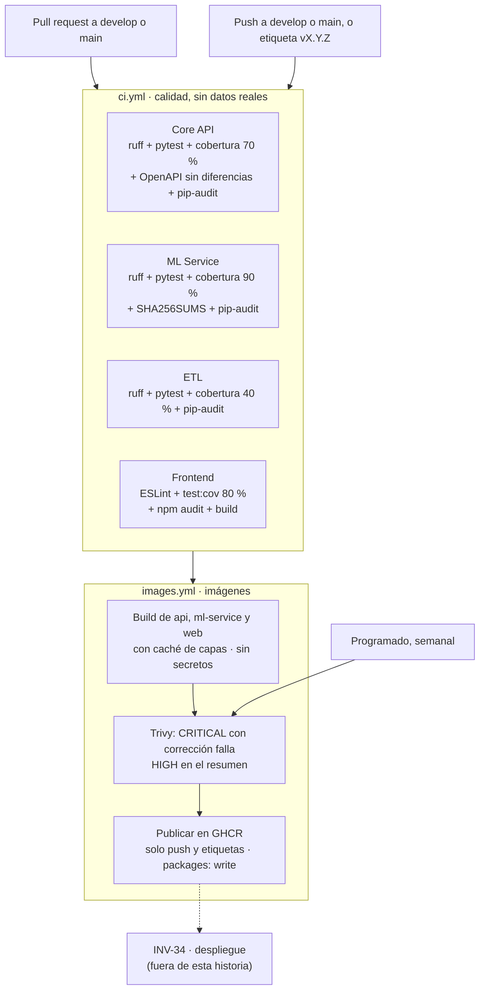

# INV-24 · Requerimientos del pipeline CI/CD con GitHub Actions

Versión del 2026-10-07. Reemplaza el borrador del mismo día después de
revisarlo contra `develop` (merge `7ef4a66`), Jira y GitHub. La revisión corrió
en Python 3.11 y sin Postgres:
- las suites de los tres servicios Python, en las imágenes del proyecto con la red desactivada;
- ruff 0.15.11 y 0.16.10;
- pip-audit;
- ESLint, con una configuración temporal;
- la exportación del OpenAPI.

Se corrigieron cifras y supuestos (ver "Revisión del borrador") y las
decisiones quedaron confirmadas (D1 a D20).

## Resumen

INV-24 es hoy una historia de cinco criterios genéricos y 5 SP. Contra el
código, **la mitad del trabajo de CI ya existe y la otra mitad no está en
ninguna historia**:

- **Ya existe:** el job del frontend (pruebas con cobertura, `npm audit` y build) y el badge del README.
- **Falta, aunque la historia lo pide:** pytest en el CI (hoy no corre ninguna prueba de Python), el lint del frontend y el build de imágenes con tags.
- **Está roto sin que se note:**
  - `ruff.toml` vive en `.github/workflows/`, donde ruff no lo busca, así que el CI corre ruff con los valores por defecto.
  - La versión de ruff está fijada solo por accidente, en `api/requirements.txt`. Si se separan las dependencias de desarrollo y queda el `pip install ruff` del CI, se instalará la última (0.16.10), y con ella `api/` da 292 hallazgos.
- **No pasaría el primer día:** las dependencias de producción de `api` y `ml_service` tienen vulnerabilidades conocidas (31 en `api`; Starlette llega a las dos con FastAPI).
- **Sin dueño:** la mitad "CD" del nombre. Ni INV-24 ni INV-34 describen un workflow de despliegue.

INV-24 entrega, en una sola historia de 8 SP (D1):
- la CI completa de los cuatro componentes;
- la actualización de las dependencias vulnerables;
- las imágenes de producción versionadas y publicadas;
- las puertas de seguridad del pipeline;
- el contrato con INV-34, que implementa el despliegue cuando exista el destino.

Un workflow de despliegue sin servidor al que desplegar no se puede verificar,
y las reglas sin deuda del fix de INV-26 piden que lo entregado esté verificado.

| Campo | Valor |
| --- | --- |
| Jira | "Pipeline CI/CD con GitHub Actions", Tareas por hacer |
| Prioridad | Highest |
| Puntos | 8 (D1); en Jira se subieron de 5 a 8 el 7 de octubre |
| Épica | E8 Infraestructura CI/CD (INV-53) |
| Sprint | Sprint 5 (21 sep – 10 oct), con vencimiento el 10 de octubre. No cierra en Sprint 5 (ver "Estimación y sprint") |
| Release | Release 2 (31 de octubre, "Ambiente: Local"), etiqueta `momento-ii` |
| Depende de | El fix de INV-26 (Node 22, Vitest y Dockerfile del frontend) y el Nginx del frontend (`7ef4a66`) |
| Alimenta a | INV-34 (despliegue), INV-36 (Nginx del agente), INV-30 a INV-33 (imagen del agente) e INV-41 (hardening) |
| Rama | `feature/INV-24-ci-cd` |

**Dentro del alcance**

- CI de `api`, `ml_service` y `etl_real`: ruff, pruebas y cobertura, sin datos reales.
- ESLint en el frontend, junto a lo que ya corre.
- `ruff.toml` en la raíz, la versión fijada en un `requirements-dev.txt` de la raíz y la limpieza mecánica en un commit aparte.
- Dependencias de desarrollo separadas de las de producción.
- La actualización de las dependencias con vulnerabilidades conocidas, FastAPI y Starlette incluidas (D6).
- Imágenes de producción de `api`, `ml-service` y `web`:
  - sin root, con healthcheck y sin herramientas de prueba;
  - los modelos van dentro de la de `ml-service`.
- Build en cada PR y publicación en GHCR con tags en `develop`, `main` y las etiquetas `vX.Y.Z`.
- pip-audit, Trivy, acciones fijadas por SHA, Dependabot y escaneo de secretos.
- Comprobación del OpenAPI y del SHA-256 de los modelos.
- Ruleset de `main` con los checks requeridos (D17).
- `docs/CI-CD.md`, la sección de CI/CD del README y la plantilla de PR.

**Fuera del alcance**

- El workflow de despliegue a AWS (OIDC, SSM, aprobación, pruebas de humo y reversa): lo implementa INV-34.
- Las pruebas de integración contra la bodega real, que necesitan datos del negocio que no deben estar en GitHub (D2).
- El hardening de la aplicación: secretos por defecto, CORS, lista negra en Redis y límite de login (ver "Reparto de la revisión técnica").
- El refactor de `useConsulta` y `AuthContext` para las reglas del compilador de React (D7).
- La protección de `develop` (D17).
- Las evaluaciones del agente de PLN con un LLM en el bucle.
- Migraciones de base de datos, copias de seguridad y observabilidad.

## Punto de partida (verificado)

| Pieza | Estado actual | Evidencia |
| --- | --- | --- |
| Workflow | `ci.yml` tiene dos jobs, `Lint backend (ruff)` (ruff sobre `api/`) y `Build frontend (Vite)` (`test:cov`, `npm audit --omit=dev --audit-level=high` y build). Corre en push y en PR a `develop` y `main` | `.github/workflows/ci.yml`; run 37686614865 en verde |
| Badge | Está en el README | — |
| Configuración de ruff | `.github/workflows/ruff.toml` no se aplica: ruff busca la configuración en el directorio del archivo y en sus ancestros. Además ignora F401 en todo el código, aunque su comentario dice que es solo para `__init__.py` | `ruff check api/` da 0 hallazgos; con `--config .github/workflows/ruff.toml`, 224 |
| Hallazgos con las reglas del equipo (ruff 0.15.11) | `api` 224, `ml_service` 113 y `etl_real` 5, en total 342. **Todos son de estilo**: UP045 200, UP006 61, I001 60 y UP035 21; ninguno es E ni F. Se corrigen solos 324. Si F401 se ignora solo en `__init__.py`, aparecen 3 importaciones sin usar más en `etl_real` | Corrida local |
| Versión de ruff | 0.15.11, en `api/requirements.txt` (producción); el `pip install ruff` del CI no cambia nada mientras esté ahí. La 0.16.10, la última, sin configuración da 292 hallazgos en `api/`, 123 en `ml_service/` y 31 en `etl_real/`: entre otras, activa por defecto B008, que marca los `Depends()` de FastAPI (62) | Corrida local con las dos versiones |
| Pruebas de `api` | Con `-m "not integracion"`, 154 pasan en unos 11 s sin red y 56 de integración quedan fuera. **Ninguna corre en el CI** | Imagen `inventaio-api` (Python 3.11.17) con `--network none` |
| Cobertura de `api` sin Postgres | **74 %** del código de la aplicación (sin `tests/` ni `scripts/`) y 58 % sobre los módulos que midió INV-25. No hay `.coveragerc` que fije qué se mide | `--cov` con las dos selecciones |
| Pruebas de `ml_service` | 175 pasan y 17 se saltan (marca `bodega`) en unos 35 s, con una cobertura de **94 %** (el `.coveragerc` omite `tests/`). **No corren en el CI** | Imagen `inventaio-ml-service` sin red, con `MODELOS_DIR` |
| Pruebas de `etl_real` | 62 pasan y 2 se saltan en unos 3 s, con una cobertura de **42 %** del código (56 % si se cuenta el archivo de pruebas). **No corren en el CI** | conda, Python 3.11.16 |
| Frontend | `test:cov` (umbral de 80 %), `npm audit` y build en el CI; **no hay script de lint**. Con ESLint 10 y `eslint-plugin-react-hooks` 7.1.1: el preset recomendado da 3 errores (`useConsulta.js:19` refs, y set-state-in-effect en `useConsulta.js:23` y `AuthContext.jsx:19`) y 4 avisos; las reglas clásicas (`rules-of-hooks` y `exhaustive-deps`), 0 errores y los mismos 4 avisos | Corrida con una configuración temporal, fuera del repositorio |
| Vulnerabilidades de Python | `api`: **31 en 9 paquetes** (tabla siguiente). `ml_service`: Starlette 0.41.3, que llega con FastAPI 0.115.6 (7), y pytest (1). `etl_real`: ninguna, con las transitivas | `pip-audit` |
| OpenAPI | **Desactualizado** en 3 líneas: la descripción de `GET /api/consulta/productos` y la del parámetro `busqueda`. V11 de INV-26 cambió el código y no se regeneró el archivo. La exportación corre sin red | Exportación en la imagen y `diff` |
| Dockerfiles | `api` y `ml_service`: `python:3.11-slim`; corren como root (uid 0 en los dos contenedores); **ninguno tiene `HEALTHCHECK`** (el de `ml-service` está solo en el compose). Instalan `requirements.txt`, que trae pytest, pytest-cov, coverage, watchfiles y, en `api`, ruff. Sus `.dockerignore` no excluyen `tests/`. `web` es multi-stage con `nginx:1.28-alpine`, cuyo proceso maestro corre como root | `api/Dockerfile`, `ml_service/Dockerfile`, `frontend/Dockerfile`, `docker exec … id` |
| Modelos | Pesan 7 MB y están en git, pero **fuera del contexto de build** de `ml_service`: el compose los monta. **El metadata no trae SHA-256**: cada rama solo tiene `archivo`. Se exportan a mano con `notebooks/exportar_modelos_nivel1_v2.py` | `models/nivel1_metadata.json` |
| Raíz del repositorio | Fuera de git pero en el disco de desarrollo: `data/` (5,6 GB de exportes del negocio), `.env`, el zip de Favorita (458 MB) y `evidencias/` (44 MB) | `git status --ignored` |
| Compose | Es de desarrollo: `--reload`, el volumen `./api:/app`, los puertos 5432, 6379, 8000, 8001 y 5050 publicados, `pgadmin:latest` con `admin123`, `version: "3.9"` (obsoleta) y contraseñas por defecto. Tiene el perfil `web` (Nginx del frontend) | `docker-compose.yml` |
| Acciones | `checkout@v4`, `setup-python@v5` y `setup-node@v4`. Cada run avisa "Node.js 20 is deprecated… forced to run on Node.js 24". Node 24 es el predeterminado desde el 16 de junio de 2026 y Node 20 se retiró el 23 de septiembre. Las mayores vigentes son v7 para `checkout`, `setup-node` y `setup-python`, y en Docker `build-push-action` v7, `metadata-action` v6, `login-action` v4 y `setup-buildx-action` v4 | Anotaciones del run y changelog de GitHub del 23 de septiembre de 2026 |
| Runner | `ubuntu-latest` pasa a Ubuntu 26.04 entre el 19 de octubre y el 19 de noviembre de 2026 | `actions/runner-images#14748` |
| Ramas | `main` y `develop` **sin protección**. El flujo es merge local con `--no-ff` y push, sin PR | API pública de GitHub (`protected: false`) |
| Repositorio | Público, creado el 2026-02-20. La rama remota vieja `github-actions-implementación-tips-89a20`, con un commit de un bot que excluía `.github/workflows` del repositorio, se eliminó el 7 de octubre (era `6a59281`) | API de GitHub y `git log` |
| Registro, tags y despliegue | No existen | — |
| Dependabot, escaneo de secretos y CodeQL | No hay `dependabot.yml` ni workflows de seguridad | `.github/` |
| Plantilla de PR | Tiene el DoD estándar y no distingue las pruebas de integración locales | `.github/pull_request_template.md` |

**Vulnerabilidades de `api`**

| Paquete | Versión | Vulnerabilidades | Versión que las corrige todas |
| --- | --- | --- | --- |
| starlette | 0.41.3 | 7 | 1.3.1 (requiere subir FastAPI: la 0.115.6 limita Starlette a menos de 0.42; la 0.142.4 pide 0.46 o más) |
| python-multipart | 0.0.20 | 6 | 0.0.31 |
| cryptography | 46.0.5 | 6 | 50.0.0 |
| pyasn1 | 0.6.3 | 3 | 0.6.4 |
| python-jose | 3.3.0 | 3 | 3.4.0 |
| anyio | 4.12.1 | 2 | 4.14.2 |
| ecdsa | 0.19.1 | 2 | 0.19.2 |
| idna | 3.11 | 1 | 3.15 |
| pytest | 8.3.4 | 1 | 9.0.3 (sale de producción con D5) |

**Sin verificar:**
- la configuración de seguridad del repositorio (escaneo de secretos y visibilidad de paquetes);
- las imágenes nuevas y Trivy, que llegan con la implementación;
- la velocidad de 33,7 SP por sprint, que viene del borrador.

## Revisión del borrador

| # | El borrador decía | Corrección |
| --- | --- | --- |
| C1 | Cobertura de `api` sin Postgres: 60 % | No se reproduce. Sobre los módulos de INV-25 da 58 %, y un umbral de 60 % fallaría el primer día. Sobre el código de la aplicación da 74 %. Se agrega un `.coveragerc` (D3) |
| C2 | El metadata ya trae el SHA-256 de los modelos | No lo trae. Se crea `models/SHA256SUMS` (D10) |
| C3 | pip-audit solo como puerta nueva | Falla el primer día: 31 vulnerabilidades en `api` y Starlette en `ml_service`. Se actualizan en esta historia (D6) |
| C4 | La versión de ruff no está fijada de forma efectiva | Sí lo está, por accidente. El riesgo es quitar ruff de `requirements.txt` y dejar el `pip install ruff` del CI (D5) |
| C5 | Ruff fijado "en un solo lugar" (P4), pero en dos `requirements-dev.txt` (CA 4, P6 y la tabla de archivos) | Un solo `requirements-dev.txt`, en la raíz (D5) |
| C6 | Node 24 forzado desde el 2 de junio y Node 20 retirado el 16 de septiembre | 16 de junio y 23 de septiembre de 2026 |
| C7 | `checkout` y `setup-node` en v6 | La mayor vigente es v7 (julio de 2026) (D14) |
| C8 | "Build frontend (Vite)" puede ser un check requerido | No hay ninguna protección de ramas y el flujo no usa PR (D17) |
| C9 | Solo `api` no tiene `HEALTHCHECK` | Ninguno de los dos Dockerfiles lo tiene |
| C10 | Modelos dentro de la imagen, con el contexto de build en la raíz | El CA 3 de INV-34 decía "S3 para modelos y backups" y cambia (D9). La raíz no se usa como contexto: tiene datos del negocio y `.env` en el disco de desarrollo |
| C11 | INV-24 cabe a inicios de Sprint 6 | Sprint 6 ya tiene 44 SP; con los 8 de INV-24 llega a 52 (ver "Estimación y sprint") |
| C12 | Las 56 pruebas de integración de `api` "se saltan" | Con `-m "not integracion"` quedan deseleccionadas: no se ejecutan ni se cuentan como saltadas |
| C13 | No contemplaba el incidente de Trivy | En marzo de 2026 (CVE-2026-33634) reescribieron 76 de las 77 etiquetas de `aquasecurity/trivy-action` con código que robaba los secretos del CI (D13) |
| C14 | Trivy falla con HIGH y CRITICAL que tengan corrección | La base Debian recibe CVE nuevos sin que cambie el código: un PR sin relación fallaría. Solo CRITICAL bloquea (D12) |
| C15 | `web` sin root, sin más | `nginx:1.28-alpine` corre como root; hace falta `nginx-unprivileged` en el puerto 8080, y eso cambia el compose y el contrato con INV-34 (D8) |
| C16 | Al implementar D6: todas las vulnerabilidades tienen versión corregida | Dos no la tienen: ecdsa (CVE-2024-23342, que el proyecto no va a corregir) y python-jose 3.5.0 (CVE-2026-85394). Ninguna aplica al Core API, que firma con HS256 y clave simétrica y restringe `algorithms=[HS256]`. Quedan en `.github/pip-audit-excepciones.txt` con su motivo y vencimiento el 2 de noviembre de 2026, antes del despliegue. Propuesta para el hardening: PyJWT en lugar de python-jose |
| C17 | Al implementar D6: subir FastAPI no cambia el contrato | Desde FastAPI 0.12x, una petición sin token recibe 401 en lugar de 403. El contrato del Core API es 403 "Not authenticated" (pruebas, scripts, Postman y documentación de INV-25), así que `BearerSinToken403` lo conserva con el mismo nombre de esquema en el OpenAPI. Pasar a 401, que es lo que pide el estándar HTTP, queda propuesto para el hardening |
| C18 | Al implementar D6: `ml_service` lista solo sus dependencias directas | Su `requirements.txt` queda, como el de `api`, con todas las versiones fijadas (pip freeze en un `python:3.11-slim` limpio): el build es reproducible y pip-audit ve las transitivas, como Starlette |
| C19 | Al implementar D6: las herramientas de desarrollo no cambian | pytest 8.3.4 tiene una vulnerabilidad conocida y pytest-asyncio 0.25 no admite pytest 9: suben a pytest 9.1.1, pytest-asyncio 1.4.0, pytest-cov 7.1.0 y coverage 7.16.2 |

## Reparto de la revisión técnica

La revisión mezcla trabajo de tres naturalezas. Lo que va en INV-24 y lo que
no, para que nada quede sin dueño:

| Hallazgo de la revisión | Estado en `develop` hoy | Dónde va |
| --- | --- | --- |
| pytest, `docker build`, `pip-audit` y escaneo de imágenes ausentes del CI | **Confirmado** | **INV-24** |
| `ml_service/` y `etl_real/` sin lint | **Confirmado** | **INV-24** |
| `ruff.toml` fuera de lugar y versión fijada solo por accidente | **Confirmado y reproducido** (0 y 292 hallazgos según la versión) | **INV-24** |
| Dependencias con vulnerabilidades conocidas | **Confirmado** (C3) | **INV-24** (D6) |
| Contenedores de desarrollo: root, sin healthcheck, pytest y ruff en `requirements.txt` | **Confirmado** | **INV-24** (imágenes) |
| "Sin contenedor de frontend ni proxy" | **Desactualizado**: ya existen `frontend/Dockerfile`, `frontend/nginx.conf` y el perfil `web` | INV-34 agrega TLS y dominio |
| Compose de producción, `pgadmin:latest`, `version: "3.9"`, puertos 5432 y 5050 publicados | **Confirmado** | **INV-34** (`docker-compose.prod.yml`) |
| Secretos por defecto (`JWT_SECRET_KEY`, `POSTGRES_PASSWORD`, `admin123`) | **Confirmado** en `api/core/config.py` y en el compose | Historia de hardening |
| CORS abierto (`allow_origins=["*"]`) en `api` y `ml_service` | **Confirmado** | Historia de hardening |
| `ml_service` sin autenticación y con el puerto 8001 publicado | **Confirmado** | Historia de hardening (red interna) e INV-34 |
| Lista negra de tokens en memoria (`_blacklisted_tokens`) | **Confirmado** en `api/auth/router.py` | Historia de hardening (Redis con TTL) |
| Sin límite de intentos de login | **Confirmado**: no hay rate limiting | Historia de hardening |
| Migraciones, rol de solo lectura, copias de seguridad y observabilidad | Solo existe `init.sql` | INV-34, INV-41 o una historia posterior |
| Cargar los `.joblib` solo si coincide su SHA-256 | El metadata **no** trae el hash (C2) | INV-24 crea `models/SHA256SUMS` y lo comprueba en el CI; la comprobación al arrancar va en hardening |
| Agente con herramientas y no Text-to-SQL libre; RBAC heredado de los routers | No existe aún | INV-31 e INV-32: hay que reescribir sus criterios (hoy INV-31 dice "NL → SQL") |
| Comparar modelos locales con un conjunto de oro | No existe | INV-30 (hoy pide "Llama 3 8B Q4") e INV-33 |
| Alinear el README y la tesis con el código (JSX, sin chat ni PWA, compose) | Discrepancias confirmadas | INV-42 (la sección de CI/CD del README sí es de INV-24) |
| Ley 1581 de 2012 | — | INV-42, con asesoría legal |

**Hardening y Release 2 (D20).** La revisión pedía el hardening "antes del
merge a `main`". En Jira, Release 2 es "Ambiente: Local", y el despliegue en
AWS es la descripción de Release 4, donde está INV-41. El hardening bloquea la
exposición a internet (INV-34), no el merge a `main` de Release 2.

## Decisiones

| Código | Tema | Decisión |
| --- | --- | --- |
| D1 | Partición | Una sola historia de 8 SP: CI de calidad, dependencias, imágenes, publicación y puertas de seguridad. El workflow de despliegue (OIDC, SSM, aprobación, humo y reversa) es de INV-34; esta historia deja el contrato |
| D2 | Pruebas en el CI | Solo las que no necesitan datos reales: 154 de `api`, 175 de `ml_service` y 62 de `etl_real`. Las 56 de integración de `api` y las 17 de bodega de `ml_service` se corren en local antes de cada merge a `develop`. La bodega real sale de exportes de Siigo del negocio y no debe estar en GitHub. La plantilla de PR lleva la casilla |
| D3 | Cobertura | Cada servicio fija qué mide en su `.coveragerc`: `api` omite `tests/` y `scripts/`; `etl_real` omite `tests/`; `ml_service` ya lo tiene. Umbrales: `api` 70 % (hoy 74 %), `ml_service` 90 % (94 %), `etl_real` 40 % (42 %) y frontend 80 % (ya existe). El ≥ 80 % de la `api` se sigue verificando en local con la bodega |
| D4 | Ruff | `ruff.toml` en la raíz con las reglas del equipo (E, F, I, UP). F401 se ignora solo en `__init__.py` y en `api/main.py`. La limpieza va en un commit aparte: 324 correcciones automáticas, más los 21 UP035 y las 3 importaciones sin usar a mano, con las pruebas en verde antes y después |
| D5 | Dependencias de desarrollo | El `requirements.txt` de cada servicio queda solo con producción. Un `requirements-dev.txt` en la raíz trae ruff, pytest, pytest-asyncio, pytest-cov y pip-audit, con versión fija: es el único lugar donde se fija ruff. El paso `pip install ruff` del CI se elimina en el mismo commit. Subir ruff es un cambio deliberado; pasar a 0.16 exige configurar B008 para FastAPI |
| D6 | Dependencias vulnerables | Se actualizan todas en esta historia, en un commit aparte. FastAPI pasa a la versión vigente en `api` y en `ml_service`, y con ella Starlette a 1.3.1 o más. También python-multipart ≥ 0.0.31, python-jose ≥ 3.4.0, cryptography, pyasn1, anyio, ecdsa e idna. Antes y después, en verde contra la bodega real: las 210 pruebas de `api` (incluida la integración), las de `ml_service` y las colecciones de Postman de INV-25 e INV-26. `api` no usa `on_event`; `ml_service` ya usa `lifespan` |
| D7 | Lint del frontend | ESLint con configuración plana: `@eslint/js` recomendado, `react-hooks/rules-of-hooks` como error, `exhaustive-deps` como aviso, las reglas del compilador de React (`refs`, `set-state-in-effect` y las demás del preset 7) como aviso y `react-refresh` como aviso. Los errores fallan el CI y los avisos se reportan. Hoy da 0 errores y 7 avisos. El refactor de `useConsulta` y `AuthContext` queda fuera |
| D8 | Imágenes | `api` y `ml-service`: `python:3.11-slim`, un usuario sin privilegios, `HEALTHCHECK` con `python -c "urllib…"` contra `/api/health` (la imagen no trae curl), `CMD` sin `--reload` (el compose de desarrollo lo sigue pasando por `command`) y un `.dockerignore` que excluye `tests/`. `web`: `nginxinc/nginx-unprivileged:1.28-alpine` escuchando en 8080, con `HEALTHCHECK` por `wget`; el compose pasa a `8080:8080` |
| D9 | Modelos | Van dentro de la imagen de `ml-service`, sin usar la raíz como contexto de build: el contexto sigue en `ml_service/`. Los modelos entran como contexto adicional: `additional_contexts: models: ./models` en el compose, `build-contexts: models=./models` en la acción y `COPY --from=models` en el Dockerfile. El CA 3 de INV-34 cambia: S3 queda solo para copias de seguridad. Si el reentrenamiento llega a correr en producción, se pasa a S3 con la misma comprobación |
| D10 | SHA-256 de los modelos | `models/SHA256SUMS`, en el formato de `sha256sum`, comprobado en el CI con `sha256sum -c`. `notebooks/exportar_modelos_nivel1_v2.py` lo regenera al exportar. Detecta una inconsistencia entre modelos y hashes, no una manipulación: la comprobación al arrancar es del hardening |
| D11 | Registro y tags | GitHub Container Registry: `ghcr.io/ddelgadillod/inventaio-{api,ml-service,web}`. Tags `sha-<7 caracteres>` y `develop`, y `vX.Y.Z` más `latest` en las etiquetas de versión. Los PR construyen sin publicar. Los paquetes siguen la visibilidad del repositorio (público): los modelos ya son públicos en git, así que la imagen no expone nada nuevo |
| D12 | Puertas de seguridad | pip-audit sobre las dependencias de producción de los tres servicios, resolviendo las transitivas. Falla ante una vulnerabilidad no aceptada; las excepciones viven en un archivo con su motivo y una fecha de vencimiento. `npm audit` sigue como está. Trivy sobre las tres imágenes: en cada PR y push fallan los CRITICAL con corrección disponible; los HIGH se reportan en el resumen del job. Las imágenes publicadas se escanean cada semana. `.trivyignore` lleva el motivo y el vencimiento. El escaneo de secretos con protección de push se activa en el repositorio. CodeQL queda opcional, fuera de esta historia |
| D13 | Cadena de suministro del CI | Todas las acciones se fijan por SHA completo, con la versión en un comentario; Dependabot las actualiza igual. Trivy, en una versión posterior al incidente de marzo de 2026. Permisos mínimos: `contents: read` en todo el workflow; `packages: write` solo en el job que publica. El escaneo corre en un job sin secretos, y la publicación en otro que depende de él |
| D14 | Acciones y runner | Las mayores vigentes, con runtime Node 24 y sin avisos de obsolescencia: `checkout`, `setup-node` y `setup-python` v7; Docker `build-push-action` v7, `metadata-action` v6, `login-action` v4 y `setup-buildx-action` v4. `runs-on: ubuntu-24.04` fijo, para que el cambio a 26.04 sea deliberado. Dependabot semanal y agrupado para `github-actions`, pip (raíz, `api`, `ml_service` y `etl_real`), npm (`frontend`) y Docker (los tres Dockerfiles) |
| D15 | OpenAPI | El CI regenera `inventaio-core-api.openapi.yml` y falla si difiere del versionado. Se regenera y se versiona en esta historia |
| D16 | Estructura | `ci.yml` (calidad) e `images.yml` (build, escaneo y publicación). Jobs de calidad: "Core API (ruff + pytest)", "ML Service (ruff + pytest)", "ETL (ruff + pytest)" y "Build frontend (Vite)", que conserva su nombre. "Lint backend (ruff)" desaparece: ningún check es requerido hoy. `concurrency` por rama, con cancelación de lo anterior solo en los PR (en `develop`, `main` y las etiquetas no se cancela una publicación). Caché de pip y npm |
| D17 | Ramas | Ruleset en `main`: PR obligatorio, checks requeridos (los cuatro de calidad y el build de imágenes) y sin force-push ni borrado. `develop` sigue con el merge local y el push: el CI avisa después del push. Lo configura la persona propietaria del repositorio al terminar, y queda documentado en `docs/CI-CD.md` |
| D18 | Servicios nuevos | Una sola lista de servicios (matriz) en `images.yml`: agregar `nlp-agent` es una línea más. `ollama` no se construye: se usa la imagen oficial con tag fijo |
| D19 | PLN | Las evaluaciones con un LLM real no corren en el CI de cada PR: las máquinas hospedadas no tienen GPU y los tiempos son impredecibles. Se corren en local y su resultado se versiona. El CI sí corre las pruebas deterministas de la capa de herramientas y de fuga de datos entre sucursales y roles, con el LLM simulado |
| D20 | Hardening | No bloquea el merge a `main` de Release 2 ("Ambiente: Local"); bloquea la exposición a internet (INV-34). Cuando quite los valores por defecto de los secretos, los jobs de pruebas definirán variables de prueba |

## Diseño del pipeline



**Esqueleto de un job de Python.** Es el de `ml_service`; el de `api` es igual,
sin `MODELOS_DIR` y con la comprobación del OpenAPI. Los SHA se completan al
implementar.

```yaml
ml-service:
  name: ML Service (ruff + pytest)
  runs-on: ubuntu-24.04
  steps:
    - uses: actions/checkout@<sha>          # v7.x
    - uses: actions/setup-python@<sha>      # v7.x
      with:
        python-version: '3.11'              # la de las imágenes
        cache: pip
        cache-dependency-path: |
          requirements-dev.txt
          ml_service/requirements.txt
    - run: pip install -r ml_service/requirements.txt -r requirements-dev.txt
    - run: ruff check ml_service/            # ruff.toml de la raíz
    - run: pytest --cov=. --cov-fail-under=90
      working-directory: ml_service
      env:
        MODELOS_DIR: ${{ github.workspace }}/models
    - run: sha256sum -c SHA256SUMS
      working-directory: models
    - run: pip-audit -r ml_service/requirements.txt
```

**Imágenes.** Una matriz con una fila por servicio:

| Servicio | Contexto | Contextos adicionales | Imagen |
| --- | --- | --- | --- |
| `api` | `api/` | — | `inventaio-api` |
| `ml-service` | `ml_service/` | `models=models/` | `inventaio-ml-service` |
| `web` | `frontend/` | — | `inventaio-web` |

**Jobs de `images.yml`**

- **Build y escaneo** (`contents: read`, sin secretos): construye cada imagen con la caché de capas, la carga en el runner y corre Trivy sobre ella.
- **Publicación** (`packages: write`, solo en push y en etiquetas):
  - depende del primer job;
  - inicia sesión en GHCR y calcula los tags con `metadata-action`;
  - publica reutilizando la caché.

**Comportamiento común**

- Permisos mínimos y caché de pip, npm y capas.
- Tiempos estimados: la CI en menos de 6 minutos (las pruebas suman menos de un minuto; el resto es instalación) y el build de imágenes en pocos minutos con caché.

## Contrato con INV-34 y despliegue del PLN

Lo que INV-24 deja definido y probado para que INV-34 implemente el despliegue
sin rehacer nada. No se implementa aquí.

| Elemento | Definición |
| --- | --- |
| Imágenes | `ghcr.io/ddelgadillod/inventaio-api`, `-ml-service` y `-web` (y `-nlp-agent` cuando exista). El compose de producción usa el tag `sha-…` o `vX.Y.Z`, nunca `latest` |
| Salud | `GET /api/health` en `api` y en `ml-service`; `GET /` en `web`. Los tres con `HEALTHCHECK` en la imagen |
| Usuario y puertos | Las tres imágenes corren sin root. `web` escucha en 8080 (y en 8443 cuando INV-34 agregue TLS); el host publica 80 y 443 hacia esos puertos |
| Variables | Las que leen `api/core/config.py` y `ml_service` (`POSTGRES_*`, `REDIS_*`, `ML_SERVICE_URL`, `JWT_SECRET_KEY`, `MODELOS_DIR`). Ninguna puede tener un valor por defecto que sirva en producción: lo exige la historia de hardening |
| Red | Solo `web` publica puertos. `api`, `ml-service`, Redis, Ollama y el agente quedan en la red interna; Postgres es RDS |
| Modelos | Dentro de la imagen de `ml-service` (D9). INV-34 cambia su CA 3: S3 solo para copias de seguridad |
| Despliegue (INV-34) | Un rol de IAM asumido por OIDC, sin claves guardadas en GitHub. Ejecución en la instancia con SSM. Entorno `production` con aprobación manual. Pruebas de humo contra los endpoints de salud y reversa al tag anterior |
| OIDC | Los repositorios creados después del 15 de julio de 2026 usan un claim `sub` con identificadores inmutables. Este se creó el 20 de febrero de 2026, así que conserva el formato clásico (`repo:ddelgadillod/InventaIO:…`) salvo que se active el nuevo, o que se renombre o transfiera. Hay que comprobarlo al escribir la política de confianza |

**Lo que el PLN le pide al despliegue.** Son insumos para INV-30, INV-34 e
INV-36, no entregables de INV-24. Las cifras de rendimiento vienen de fuentes
públicas y no se verificaron en esta revisión.

- **Ollama como contenedor oficial con tag fijo**, volumen nombrado para los modelos y **sin puerto publicado**: por defecto solo escucha en el equipo local y no trae autenticación.
- **El modelo no va en la imagen.** Se descarga en el despliegue con un paso idempotente. Antes de dar el servicio por sano, ese paso verifica que el modelo quedó disponible (`ollama ps` o `/api/tags`).
- **La instancia presupuestada es solo de CPU** (c6i.2xlarge: 8 vCPU y 16 GiB). Referencias públicas:
  - un modelo de 8B cuantizado a 4 bits pesa unos 4,7 GB, y conviene tener cerca del doble de RAM;
  - en 8 vCPU rinde entre 5 y 12 tokens por segundo para una sola persona;
  - los de 3B, entre 10 y 25.

  Alcanza para una demostración con streaming y poca concurrencia, no para varias consultas simultáneas.
- **La elección del modelo** se decide con un conjunto de oro y mediciones de latencia en el hardware real, no por reputación (INV-30 hoy pide "Llama 3 8B Q4"). Si el 8B no cabe con holgura junto a `api` y `ml-service`, el candidato es un modelo más pequeño o una GPU puntual.
- **Ajustes del servidor** que hay que fijar y documentar: `OLLAMA_NUM_PARALLEL` (cada ranura reserva su caché y su memoria) y el tiempo que el modelo permanece cargado.
- **Nginx (INV-36)** necesita WebSocket o streaming y tiempos de espera mayores que el del cliente, como ya hace `frontend/nginx.conf` con 135 s.

## Criterios de aceptación

Reemplazan los cinco originales.

**CI de calidad**

1. `api`, `ml_service` y `etl_real` pasan ruff con el `ruff.toml` de la raíz y la versión de `requirements-dev.txt`. Un PR con una infracción falla el check del servicio.
2. Las pruebas que no necesitan datos reales corren en el CI con Python 3.11 y sin Postgres: `api` con `-m "not integracion"`, `ml_service` y `etl_real`. Un PR con una prueba rota falla el check.
3. Cada servicio fija en su `.coveragerc` qué se mide y tiene el umbral de D3. Un PR que lo baje falla.
4. `ruff.toml` está en la raíz. `.github/workflows/ruff.toml` y el paso `pip install ruff` se eliminan, y ruff se fija solo en `requirements-dev.txt`.
5. Las infracciones que revela la configuración se corrigen en un commit aparte, mecánico, con las pruebas de los tres servicios en verde antes y después.
6. El frontend tiene `npm run lint` con la configuración de D7 y el CI lo ejecuta. Los errores fallan el check y los avisos se reportan.
7. Los `requirements.txt` de los servicios solo tienen dependencias de producción; las de desarrollo están en el `requirements-dev.txt` de la raíz.
8. Las dependencias de `api` y `ml_service` se actualizan hasta que pip-audit no reporte vulnerabilidades (D6). Antes y después del cambio pasan, contra la bodega real, las 210 pruebas de `api`, las de `ml_service` y las colecciones de Postman.
9. pip-audit revisa las dependencias de producción de los tres servicios, incluidas las transitivas, y falla ante una vulnerabilidad no aceptada. Las excepciones están en un archivo con su motivo y una fecha de vencimiento. `npm audit` sigue como está.
10. El CI regenera `inventaio-core-api.openapi.yml` y falla si difiere del versionado. El archivo se regenera y se versiona en esta historia.
11. `models/SHA256SUMS` existe, el CI lo comprueba y el exportador de modelos lo regenera (D10).

**Imágenes**

12. Las imágenes de `api`, `ml-service` y `web` se construyen en cada PR, y un fallo del build falla el check.
13. Cada imagen corre sin root, tiene `HEALTHCHECK` y no trae herramientas ni pruebas. Con `docker-compose.verify.yml`, las tres arrancan y quedan `healthy`.
14. La imagen de `ml-service` incluye los modelos por el contexto adicional (D9), y ninguna imagen usa la raíz del repositorio como contexto.
15. Trivy escanea las imágenes. Un CRITICAL con corrección disponible falla el check; los HIGH aparecen en el resumen; hay un escaneo semanal; `.trivyignore` tiene el motivo y el vencimiento de cada excepción.
16. En `develop`, en `main` y en las etiquetas `vX.Y.Z` se publican en GHCR con los tags de D11. Los PR no publican. Solo el job que publica tiene `packages: write`, y el de escaneo no tiene secretos.

**Mantenimiento y trazabilidad**

17. Todas las acciones están fijadas por SHA, con su versión en un comentario y en la mayor vigente con Node 24. Ningún run muestra avisos de obsolescencia. Los jobs corren en `ubuntu-24.04`. Dependabot abre PR semanales para acciones, pip, npm y Docker.
18. `main` tiene un ruleset con PR obligatorio, los checks requeridos de D17 y sin force-push ni borrado; está documentado en `docs/CI-CD.md`.
19. El README tiene una sección "CI/CD" con los workflows y su estado.
20. `docs/CI-CD.md` explica el pipeline, cómo correr lo mismo en local, qué pruebas son solo locales, cómo agregar un servicio y el contrato con INV-34. La plantilla de PR incluye la casilla de integración local.
21. El escaneo de secretos con protección de push está activo en el repositorio.

## Verificación

El DoD de "pruebas unitarias con cobertura ≥ 80 %" no aplica a un workflow. La
historia se verifica con PR de prueba hacia `develop`, que dejan su evidencia
en el repositorio:

| Caso | Esperado |
| --- | --- |
| PR sin cambios funcionales | Todos los checks en verde |
| PR con una importación sin usar en `api/` | Falla el check de `api` |
| PR con una prueba rota en `ml_service/` | Falla el check de `ml_service` |
| PR que elimina pruebas de `api/` y baja la cobertura | Falla el umbral |
| PR con un error de ESLint (un hook dentro de un condicional) | Falla el check del frontend |
| PR que fija una versión vulnerable (por ejemplo, python-jose 3.3.0) | Falla pip-audit |
| PR que cambia la descripción de un parámetro sin regenerar el OpenAPI | Falla la comprobación |
| PR que cambia un `.joblib` sin actualizar `SHA256SUMS` | Falla la comprobación |
| PR con un `Dockerfile` roto | Falla el build de imágenes |
| Push a `develop` | Imágenes publicadas con los tags `sha-…` y `develop` |
| Etiqueta `v1.1.0` | Imágenes con `v1.1.0` y `latest` |
| Push directo a `main` | Rechazado por el ruleset |
| `docker-compose.verify.yml` | Las tres imágenes arrancan sin root y quedan `healthy` |
| Ejecución semanal | El escaneo de Trivy corre sobre las imágenes publicadas |

## Estimación y sprint

**8 SP (D1).** Jira tiene 5, así que hay que actualizarlo. Lo medido reduce la incertidumbre del borrador:
- la limpieza de ruff es solo de estilo (el 95 % se corrige solo);
- ESLint da 0 errores con la configuración de D7.

Lo que suma riesgo es D6, por el cambio de versión mayor de Starlette.

**Calendario**

- Sprint 5 cierra el 10 de octubre y quedan tres días hábiles: INV-24 no cierra en este sprint.
- En Sprint 6, que ya tiene 44 SP contra una velocidad de 33,7, INV-24 lo lleva a 52. Decisión del 7 de octubre: no sale ninguna historia; Sprint 6 se planea con los 52 SP.
- Con lo que queda de Sprint 5 se pueden adelantar los pasos 2 a 4 del orden de ejecución.

## Orden de ejecución

| Paso | Qué | Commit |
| --- | --- | --- |
| 1 | Estos requerimientos | `docs` |
| 2 | `requirements-dev.txt` en la raíz, `requirements.txt` solo de producción, `ruff.toml` en la raíz y los jobs de Python en `ci.yml` | Uno |
| 3 | `ruff check --fix` y las correcciones a mano | Aparte, mecánico (se publica junto con el paso 2 para que el CI no quede en rojo) |
| 4 | `.coveragerc` de `api` y `etl_real` y los umbrales | Uno |
| 5 | Actualización de dependencias (D6), con la integración y Postman antes y después | Aparte |
| 6 | ESLint en el frontend | Uno |
| 7 | OpenAPI regenerado y `models/SHA256SUMS`, con sus comprobaciones | Uno |
| 8 | Dockerfiles, `.dockerignore`, compose y `docker-compose.verify.yml` | Uno |
| 9 | `images.yml` con Trivy y publicación en GHCR | Uno |
| 10 | Dependabot, plantilla de PR, `docs/CI-CD.md` y README | Uno |
| 11 | PR de verificación (tabla anterior) | — |
| 12 | Integrar a `develop`; ruleset de `main` y escaneo de secretos (la persona propietaria) | — |

## Definition of Done

- [ ] Cumple los criterios de aceptación.
- [ ] Verificada con los PR de prueba y su evidencia en el repositorio.
- [ ] Las suites completas, incluida la integración contra la bodega real, en verde antes y después de D4 y D6.
- [ ] Las tres imágenes construidas y sanas con `docker-compose.verify.yml`.
- [ ] Sin avisos de obsolescencia en los runs.
- [ ] Autorrevisión documentada en el commit.
- [ ] `docs/CI-CD.md` y la sección del README.
- [ ] Integrado en `develop`, con los workflows en verde.
- [ ] Sin bugs bloqueantes.

## Riesgos y limitaciones

- **El CI no cubre la integración.** Quedan fuera 73 pruebas (56 de `api` y 17 de `ml_service`), las que dan el ≥ 80 % de cobertura de la API. Un cambio que solo se rompa contra la bodega real no lo detecta el CI. Se mitiga con la casilla de la plantilla; se resolvería del todo con una bodega sintética mínima para el CI, que sería una historia aparte.
- **`develop` sin protección (D17).** El CI avisa después del push, no lo impide. Solo `main` bloquea.
- **Subida de FastAPI y Starlette (D6).** Starlette 1.x quitó APIs obsoletas. Lo mitigan las 210 pruebas y las colecciones de Postman. Si algo se rompe y no cabe en la historia, la salida es una excepción con vencimiento en pip-audit, no dejar la puerta apagada.
- **Vulnerabilidades sin corrección (C16).** ecdsa y python-jose quedan aceptadas hasta el 2 de noviembre; al vencer, el CI falla hasta que alguien las revise.
- **Piso de cobertura.** Los umbrales de D3 son el valor real sin Postgres menos un margen pequeño, no una meta.
- **Limpieza de ruff.** Toca casi todos los archivos de Python (342 cambios de estilo) y puede chocar con ramas abiertas. Se hace sin ramas en curso y en un commit aparte.
- **Versión de ruff.** Subirla cambia los resultados (0 frente a 292 hallazgos sin configuración): por eso se fija y se sube de forma deliberada.
- **Trivy.** Las bases Debian y Alpine reciben CVE nuevos sin que cambie el código. Solo CRITICAL bloquea; el resto se reporta y se revisa cada semana.
- **Cadena de suministro.** Una acción comprometida ve lo que ve su job. Los SHA fijos y los permisos por job (D13) limitan el daño.
- **Modelos dentro de la imagen.** Funciona mientras el reentrenamiento sea manual. En el repositorio no hay un reentrenamiento programado, aunque INV-29 figura como finalizada en Jira. Si llega a producción, se pasa a S3.
- **Repositorio público.** Las imágenes y los modelos son públicos. No traen datos del negocio, y los modelos ya están en git.
- **Runner.** `ubuntu-24.04` se fija; el paso a 26.04 queda como un cambio deliberado posterior.
- **PLN sin GPU.** El presupuesto de AWS es solo de CPU; ver los ajustes del contrato.
- **No verificado:** las imágenes nuevas, Trivy y la configuración de seguridad del repositorio.

## Pendientes de confirmar

Ninguno bloquea el arranque. Los del 7 de octubre ya se resolvieron: no sale ninguna historia de Sprint 6, INV-24 quedó en 8 SP en Jira y la rama remota vieja se eliminó.

| # | Pregunta | Valor por defecto mientras tanto |
| --- | --- | --- |
| 1 | Actualizar en Jira los criterios de INV-24, el CA 3 de INV-34 (S3 solo para copias de seguridad), el release de INV-34 (Release 3 vence el 29 de septiembre y el despliegue en AWS es Release 4) e INV-41 sin sprint | Sin cambios en Jira hasta aprobarlo |

## Ambiente de desarrollo

1. Partir de la rama `feature/INV-24-ci-cd`, creada desde `develop` (`7ef4a66`).
2. Repetir en local lo que hará el CI:
   - `ruff check` en la raíz;
   - `pytest -m "not integracion"` en `api`;
   - `pytest` en `ml_service` (con `MODELOS_DIR` apuntando a `models/`) y en `etl_real`;
   - `npm run lint`, `npm run test:cov` y `npm run build` en `frontend/`.
   Sin Postgres, como en el CI: `docker run --rm --network none -v $PWD/api:/app:ro -w /app inventaio-api python -m pytest -m "not integracion"`.
3. Las pruebas de integración se siguen corriendo en local con la bodega real antes de cada merge: `docker exec inventaio-api python -m pytest`, y en `ml_service`, `POSTGRES_HOST=localhost ~/venvs/inventaio/bin/python -m pytest`.
4. Validar los workflows con PR de prueba hacia `develop`: el estado de cada check queda en el PR.

**Archivos a crear o tocar**

| Archivo | Cambio |
| --- | --- |
| `docs/INV-24-requerimientos.md` (este) | Requerimientos |
| `.github/workflows/ci.yml` | Jobs de `api`, `ml_service`, `etl_real` y frontend con lint; acciones por SHA |
| `.github/workflows/images.yml` (nuevo) | Build, Trivy, publicación y escaneo semanal |
| `.github/dependabot.yml` (nuevo) | Acciones, pip, npm y Docker |
| `.github/pull_request_template.md` | Casilla de integración local |
| `ruff.toml` (nuevo, en la raíz); `.github/workflows/ruff.toml` (se elimina) | Configuración efectiva |
| `requirements-dev.txt` (nuevo, en la raíz) | ruff, pytest, pytest-asyncio, pytest-cov y pip-audit |
| `api/requirements.txt`, `ml_service/requirements.txt` | Solo producción, con las versiones de D6 |
| `api/.coveragerc`, `etl_real/.coveragerc` (nuevos) | Qué mide la cobertura |
| Archivo de excepciones de pip-audit y `.trivyignore` (nuevos) | Excepciones con motivo y vencimiento |
| `api/Dockerfile`, `ml_service/Dockerfile`, `frontend/Dockerfile`, sus `.dockerignore` y `frontend/nginx.conf` | Sin root, `HEALTHCHECK`, sin `--reload`; modelos por contexto adicional; `web` en 8080 |
| `docker-compose.yml` | `additional_contexts` de `ml-service`, `command` de desarrollo con `--reload`, el healthcheck de `api` y `web` en `8080:8080` |
| `docker-compose.verify.yml` (nuevo) | Verificación de las tres imágenes |
| `frontend/package.json`, `frontend/eslint.config.js` (nuevo) | Lint |
| `api/tests/postman/inventaio-core-api.openapi.yml` | Regenerado |
| `models/SHA256SUMS` (nuevo), `notebooks/exportar_modelos_nivel1_v2.py` | Hash de los modelos |
| `docs/CI-CD.md` (nuevo), `README.md` | Documentación y sección de CI/CD |
| Los archivos de Python que cambie `ruff --fix` | Commit mecánico aparte |
